Meta Analysis - Network Comparison Combined (Family)
================
2024-03-01

``` r
myPaths <- .libPaths()
myPaths <- c(myPaths, "~/MetaIBS/MetaIBS-library")
myPaths <- c(myPaths[3], myPaths[1], myPaths[2])
.libPaths(myPaths)  # add new path
```

------------------------------------------------------------------------

# 1. IMPORT

------------------------------------------------------------------------

## 1.1. Libraries

``` r
library(phyloseq) # Handling and analysis of high-throughput microbiome census data.
library(tidyverse)
library(ggplot2)
library(SpiecEasi)
library(igraph)
library(NetCoMi)
```

------------------------------------------------------------------------

# 2. FUNCTIONS

------------------------------------------------------------------------

------------------------------------------------------------------------

# 3. NETWORK INFERENCE

------------------------------------------------------------------------

## 3.1. Total Merge

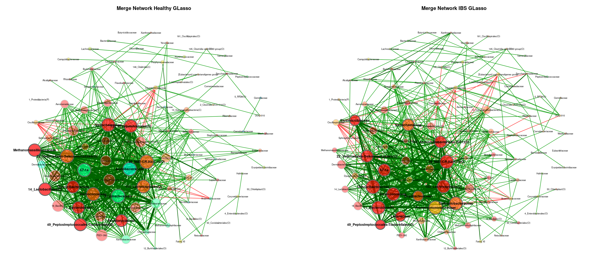<!-- -->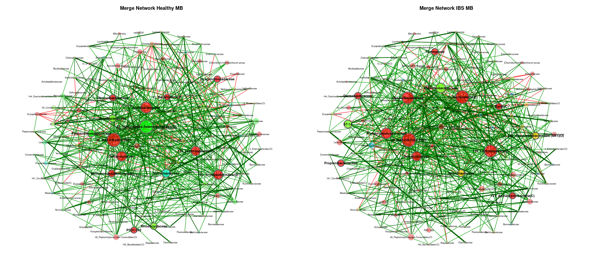<!-- -->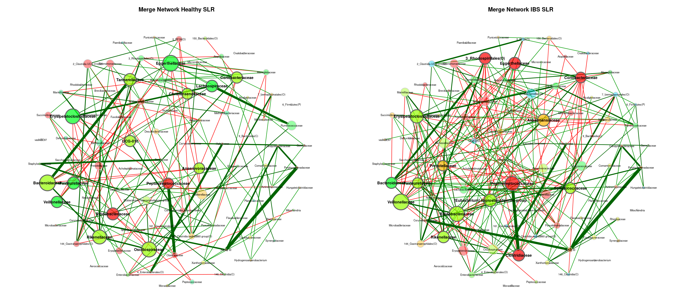<!-- -->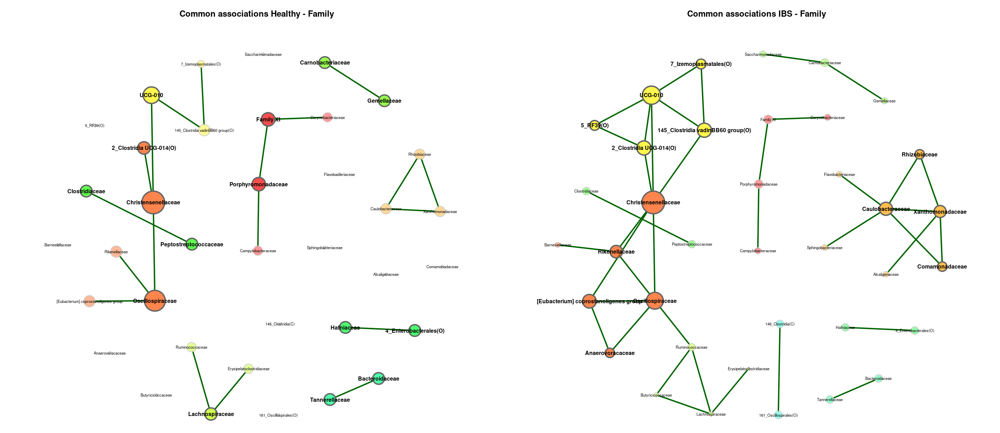<!-- -->

## 3.2. Sample Type

## 3.3. Sequencing Technology

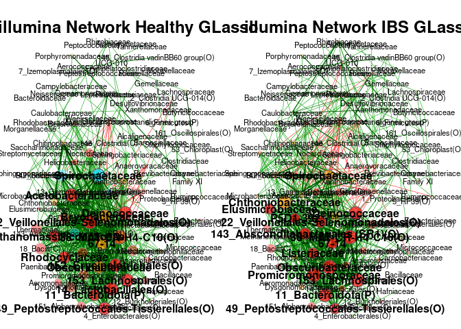<!-- -->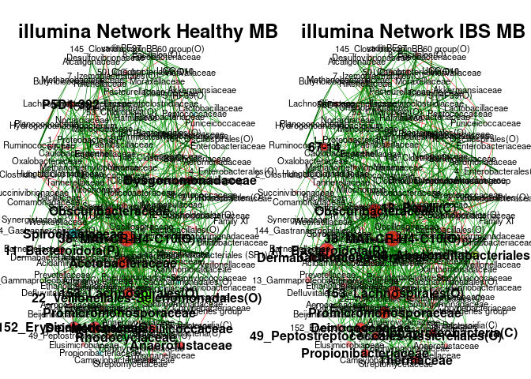<!-- -->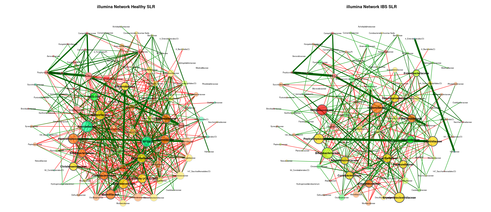<!-- -->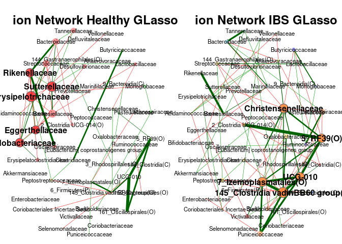<!-- -->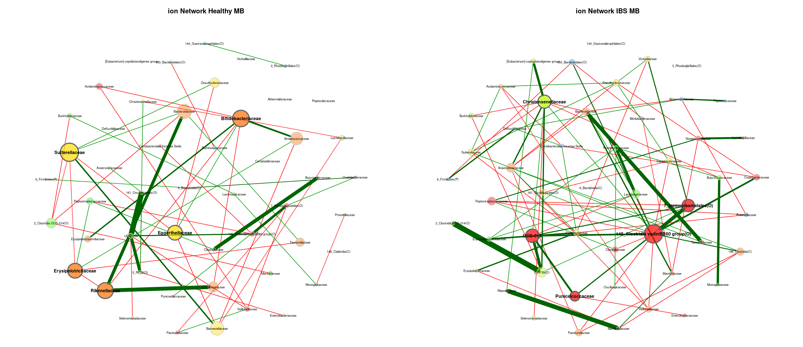<!-- -->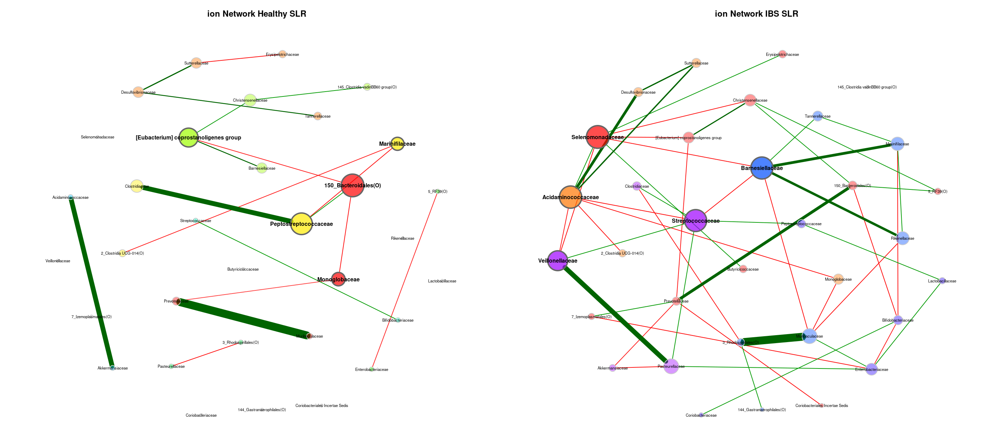<!-- -->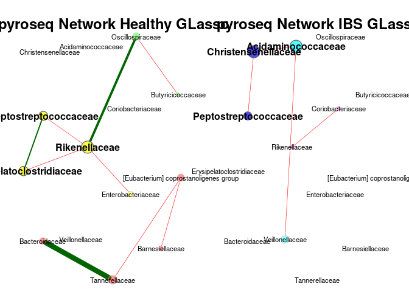<!-- -->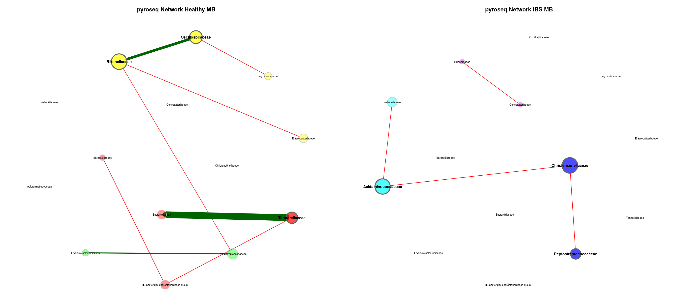<!-- --><!-- -->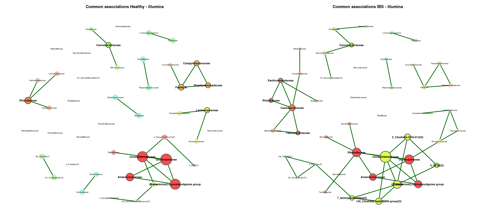<!-- -->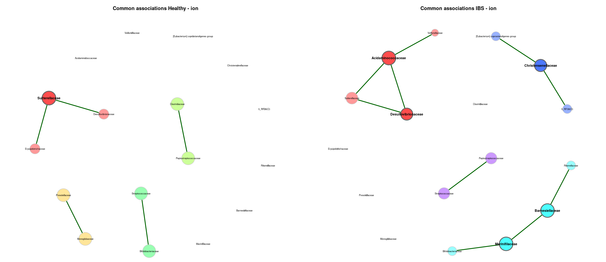<!-- -->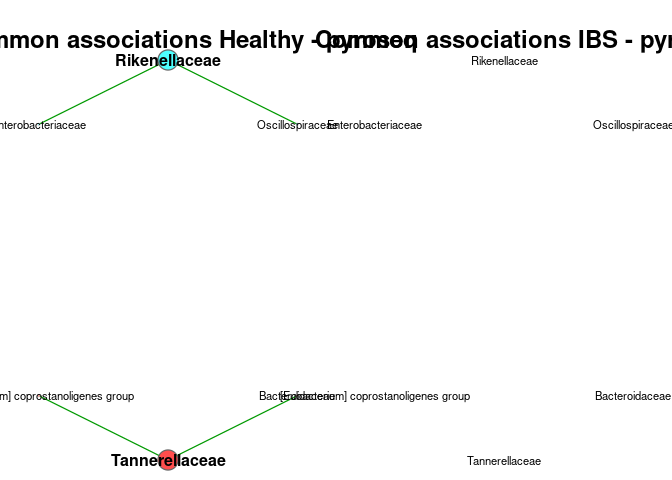<!-- -->

## 3.4. Variable Region

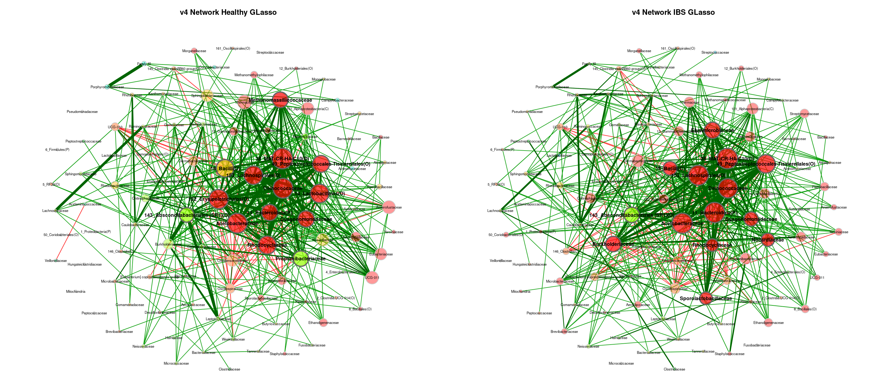<!-- -->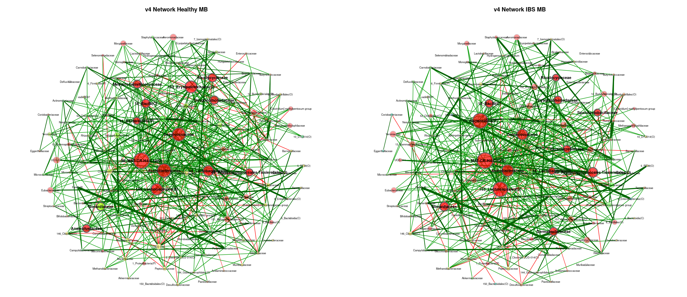<!-- -->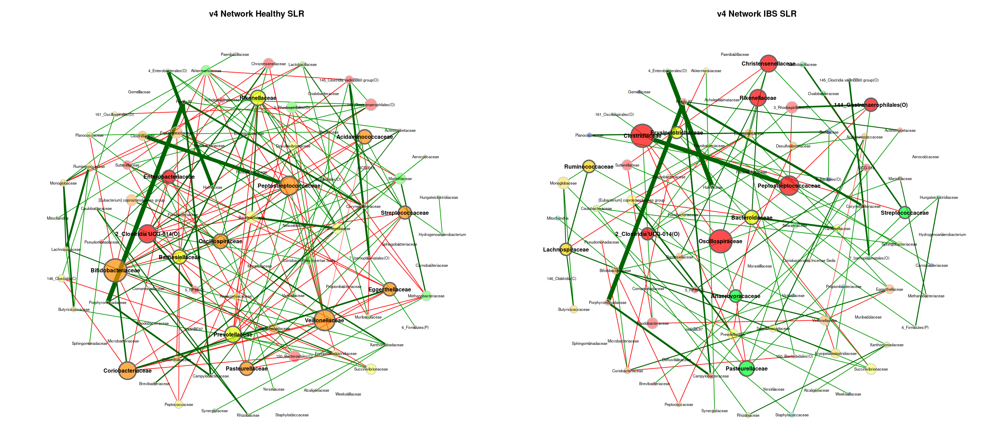<!-- -->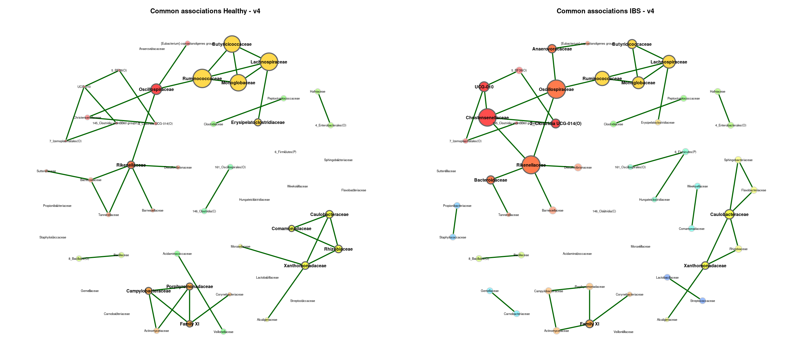<!-- -->
