Meta Analysis - Network Comparison (Genus)
================
2024-03-01

------------------------------------------------------------------------

# 1. IMPORT

------------------------------------------------------------------------

## 1.1. Libraries

``` r
library(phyloseq) # Handling and analysis of high-throughput microbiome census data.
library(tidyverse)
library(ggplot2)
library(SpiecEasi)
library(igraph)
library(NetCoMi)
```

------------------------------------------------------------------------

# 2. FUNCTIONS

------------------------------------------------------------------------

------------------------------------------------------------------------

# 3. META-ANALYSIS

------------------------------------------------------------------------

## 3.1. Summary Plots

<!-- --><!-- --><!-- --><!-- --><!-- --><!-- --><!-- -->

## 3.2. Individual Plots

<!-- --><!-- --><!-- --><!-- --><!-- -->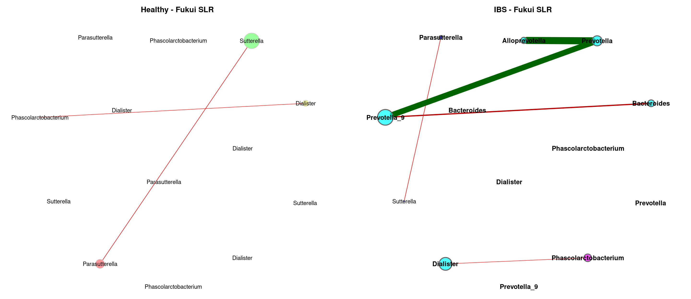<!-- --><!-- --><!-- -->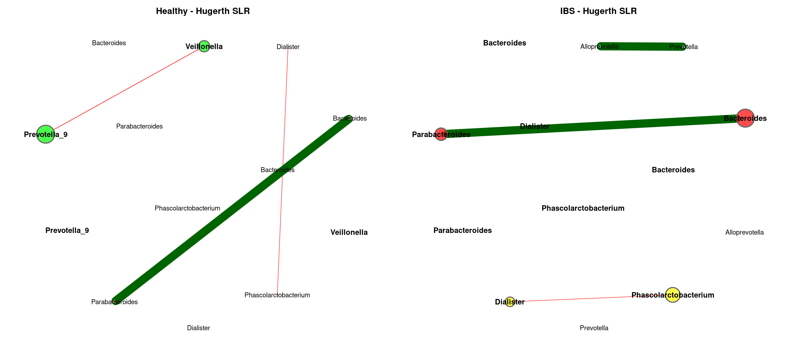<!-- --><!-- -->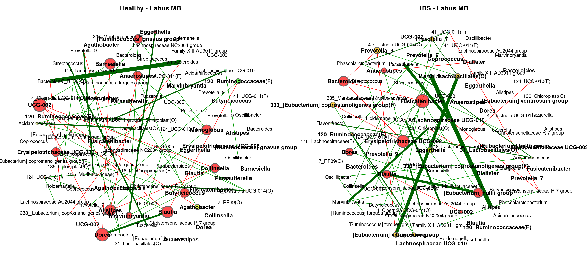<!-- --><!-- -->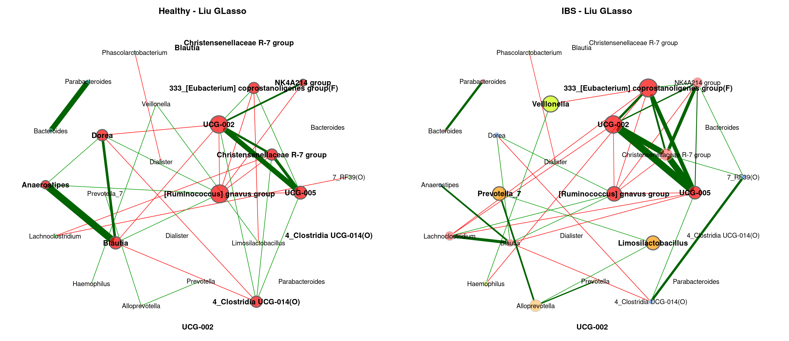<!-- -->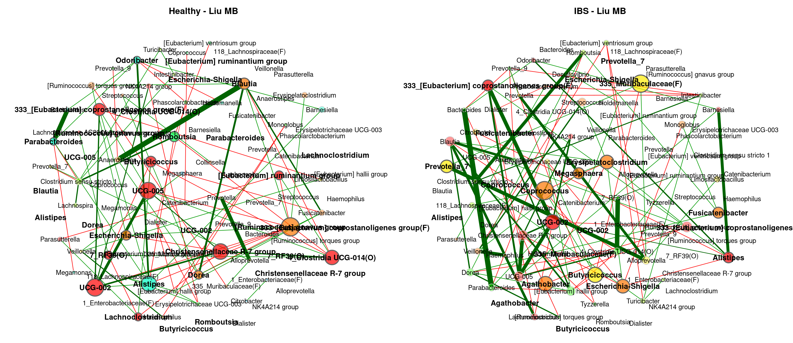<!-- -->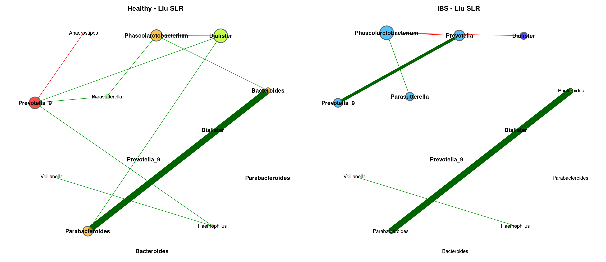<!-- --><!-- -->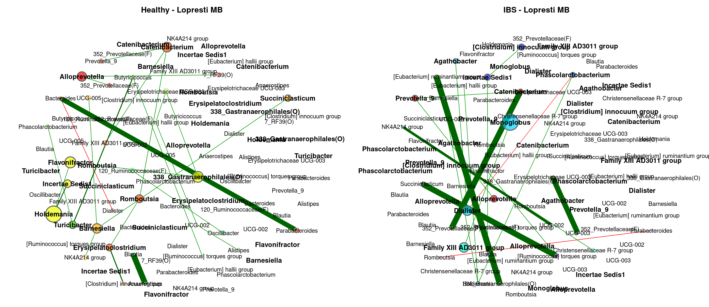<!-- -->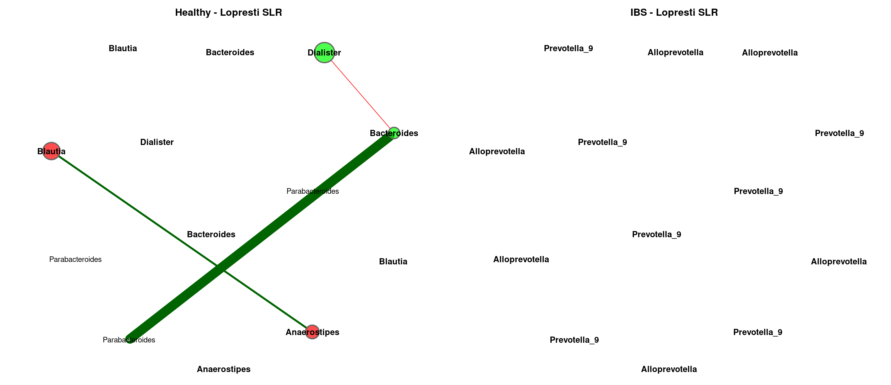<!-- --><!-- --><!-- --><!-- -->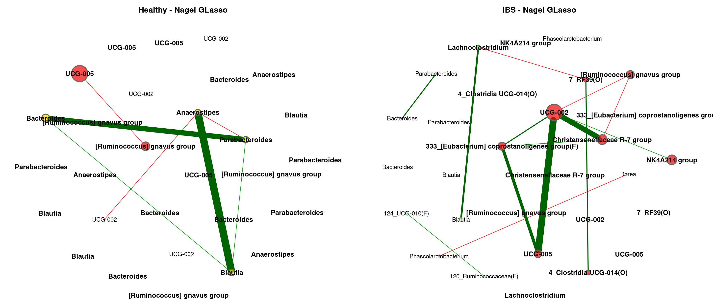<!-- -->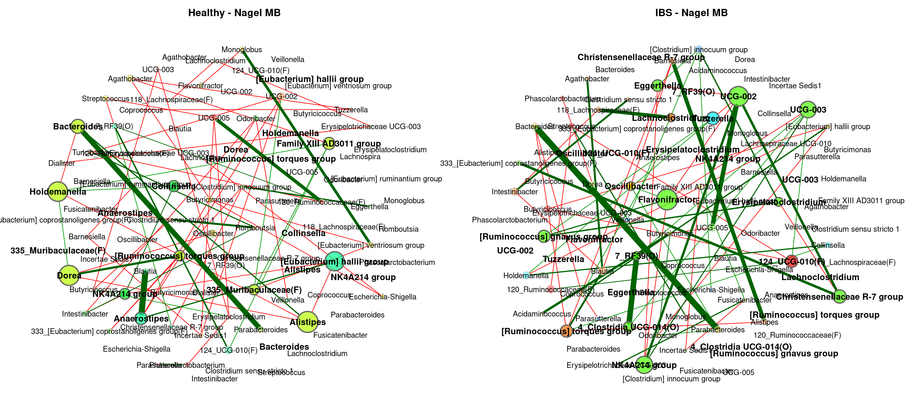<!-- --><!-- -->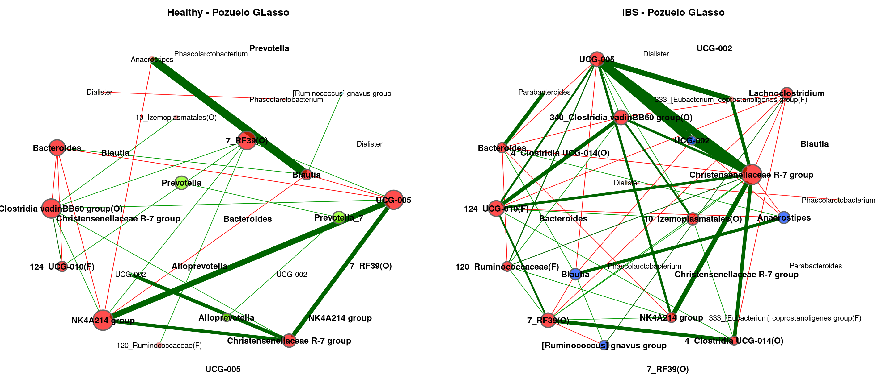<!-- -->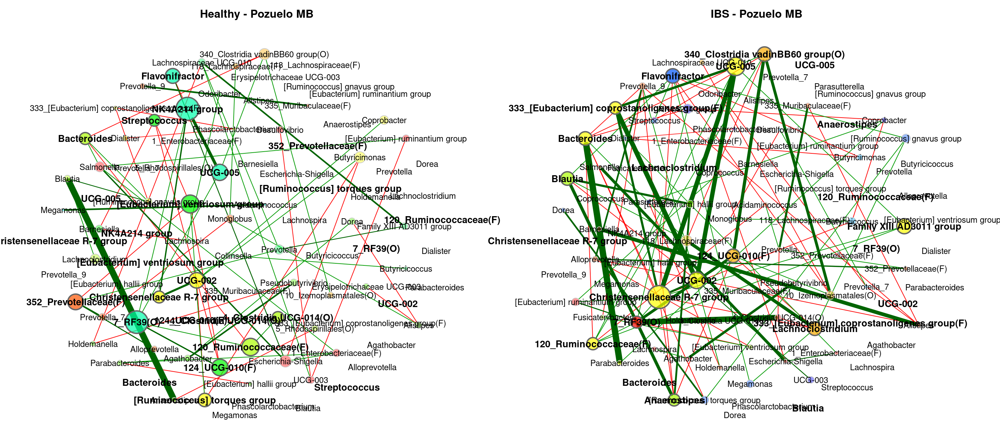<!-- -->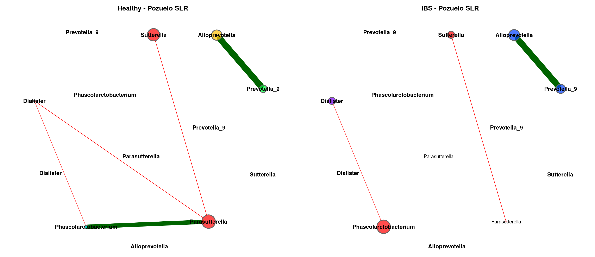<!-- --><!-- --><!-- --><!-- -->

## 3.3. Global Properties

### 3.3.1. GLasso

|  | agp.Healthy | agp.IBS | fukui.Healthy | fukui.IBS | hugerth.Healthy | hugerth.IBS | labus.Healthy | labus.IBS | liu.Healthy | liu.IBS | lopresti.Healthy | lopresti.IBS | mars.Healthy | mars.IBS | nagel.Healthy | nagel.IBS | zeber.Healthy | zeber.IBS | zhuang.Healthy | zhuang.IBS |
|:---|---:|---:|---:|---:|---:|---:|---:|---:|---:|---:|---:|---:|---:|---:|---:|---:|---:|---:|---:|---:|
| Relative LCC size | 0.71765 | 0.68235 | 0.64045 | 0.85393 | 0.68605 | 0.88372 | 0.15942 | 0.17391 | 0.82051 | 0.84615 | 0.10345 | 0.10345 | 0.77108 | 0.89157 | 0.49398 | 0.85542 | 0.33735 | 0.80723 | 0.18605 | 0.52326 |
| Clustering coefficient | 0.60646 | 0.63326 | 0.20944 | 0.30342 | 0.60699 | 0.31580 | 0.77056 | 0.20303 | 0.29154 | 0.47454 | 0.91975 | 0.58336 | 0.47628 | 0.38910 | 0.44291 | 0.30303 | 0.44294 | 0.33728 | 0.60246 | 0.23162 |
| Modularity | 0.48189 | 0.45361 | 0.55807 | 0.40698 | 0.35721 | 0.39684 | 0.08545 | 0.44133 | 0.55071 | 0.44869 | 0.03306 | 0.12245 | 0.55448 | 0.52264 | 0.59641 | 0.61817 | 0.36727 | 0.36775 | 0.44944 | 0.56304 |
| Positive edge percentage | 77.57009 | 76.53631 | 54.34783 | 63.13559 | 61.57025 | 62.13992 | 100.00000 | 100.00000 | 62.69841 | 62.11454 | 100.00000 | 100.00000 | 76.77419 | 62.13018 | 52.17391 | 54.33071 | 61.81818 | 61.85567 | 80.00000 | 60.29412 |
| Edge density | 0.11694 | 0.10829 | 0.05764 | 0.08281 | 0.14144 | 0.08526 | 0.58182 | 0.21212 | 0.06250 | 0.10583 | 0.73333 | 0.46667 | 0.07688 | 0.06257 | 0.08415 | 0.05111 | 0.14550 | 0.08774 | 0.25000 | 0.06869 |
| Natural connectivity | 0.02831 | 0.02883 | 0.02175 | 0.01954 | 0.03334 | 0.02050 | 0.18473 | 0.11964 | 0.02039 | 0.02412 | 0.30430 | 0.26966 | 0.02247 | 0.01907 | 0.03137 | 0.01761 | 0.04959 | 0.02274 | 0.09136 | 0.02814 |
| Vertex connectivity | 1.00000 | 1.00000 | 1.00000 | 1.00000 | 1.00000 | 1.00000 | 1.00000 | 1.00000 | 1.00000 | 1.00000 | 1.00000 | 1.00000 | 1.00000 | 1.00000 | 1.00000 | 1.00000 | 1.00000 | 1.00000 | 1.00000 | 1.00000 |
| Edge connectivity | 1.00000 | 1.00000 | 1.00000 | 1.00000 | 1.00000 | 1.00000 | 1.00000 | 1.00000 | 1.00000 | 1.00000 | 1.00000 | 1.00000 | 1.00000 | 1.00000 | 1.00000 | 1.00000 | 1.00000 | 1.00000 | 1.00000 | 1.00000 |
| Average dissimilarity\* | 0.68409 | 0.68502 | 0.70678 | 0.69461 | 0.68724 | 0.68775 | 0.65469 | 0.66325 | 0.69294 | 0.69161 | 0.65719 | 0.67156 | 0.68675 | 0.69055 | 0.70279 | 0.70269 | 0.69675 | 0.69354 | 0.69498 | 0.69764 |
| Average path length\*\* | 1.86128 | 2.11528 | 2.68784 | 1.96936 | 1.68452 | 1.95398 | 1.13115 | 1.99971 | 2.53487 | 1.89222 | 0.85004 | 1.11418 | 2.50202 | 2.60074 | 3.08835 | 2.92561 | 2.06008 | 2.17572 | 1.93384 | 3.02594 |

### 3.3.2 MB

|  | agp.Healthy | agp.IBS | fukui.Healthy | fukui.IBS | hugerth.Healthy | hugerth.IBS | labus.Healthy | labus.IBS | liu.Healthy | liu.IBS | lopresti.Healthy | lopresti.IBS | mars.Healthy | mars.IBS | nagel.Healthy | nagel.IBS | zeber.Healthy | zeber.IBS | zhuang.Healthy | zhuang.IBS |
|:---|---:|---:|---:|---:|---:|---:|---:|---:|---:|---:|---:|---:|---:|---:|---:|---:|---:|---:|---:|---:|
| Relative LCC size | 0.85882 | 0.81176 | 0.86517 | 0.94382 | 0.76744 | 0.97674 | 0.84058 | 0.84058 | 0.98718 | 0.97436 | 0.27586 | 0.36207 | 1.00000 | 1.00000 | 0.97590 | 1.00000 | 0.97590 | 0.98795 | 1.00000 | 0.98837 |
| Clustering coefficient | 0.39872 | 0.39109 | 0.09927 | 0.17080 | 0.44096 | 0.15734 | 0.08078 | 0.11687 | 0.15532 | 0.23728 | 0.00000 | 0.07038 | 0.13460 | 0.09689 | 0.09350 | 0.13744 | 0.07703 | 0.09757 | 0.26540 | 0.08000 |
| Modularity | 0.53195 | 0.51133 | 0.60820 | 0.49311 | 0.52420 | 0.43031 | 0.67671 | 0.68062 | 0.53426 | 0.48609 | 0.49414 | 0.57937 | 0.49671 | 0.48053 | 0.54784 | 0.61333 | 0.56061 | 0.42765 | 0.26353 | 0.53766 |
| Positive edge percentage | 83.24324 | 77.24551 | 55.55556 | 63.63636 | 75.81699 | 61.01695 | 77.33333 | 83.09859 | 58.57143 | 68.60465 | 81.25000 | 76.19048 | 67.63006 | 56.54762 | 42.74809 | 58.06452 | 60.93750 | 56.59341 | 52.52525 | 52.34899 |
| Edge density | 0.07040 | 0.07118 | 0.03691 | 0.05364 | 0.07133 | 0.06770 | 0.04537 | 0.04295 | 0.04785 | 0.06035 | 0.13333 | 0.10000 | 0.05084 | 0.04937 | 0.04043 | 0.03644 | 0.03951 | 0.05480 | 0.13543 | 0.04174 |
| Natural connectivity | 0.01913 | 0.02010 | 0.01549 | 0.01539 | 0.02076 | 0.01629 | 0.02117 | 0.02114 | 0.01624 | 0.01734 | 0.08469 | 0.06144 | 0.01554 | 0.01522 | 0.01496 | 0.01456 | 0.01512 | 0.01576 | 0.02193 | 0.01450 |
| Vertex connectivity | 1.00000 | 1.00000 | 1.00000 | 1.00000 | 1.00000 | 1.00000 | 1.00000 | 1.00000 | 1.00000 | 1.00000 | 1.00000 | 1.00000 | 1.00000 | 1.00000 | 1.00000 | 1.00000 | 1.00000 | 1.00000 | 2.00000 | 1.00000 |
| Edge connectivity | 1.00000 | 1.00000 | 1.00000 | 1.00000 | 1.00000 | 1.00000 | 1.00000 | 1.00000 | 1.00000 | 1.00000 | 1.00000 | 1.00000 | 1.00000 | 1.00000 | 1.00000 | 1.00000 | 1.00000 | 1.00000 | 2.00000 | 1.00000 |
| Average dissimilarity\* | 0.68818 | 0.68923 | 0.70440 | 0.69544 | 0.68765 | 0.69324 | 0.67385 | 0.66645 | 0.69504 | 0.68897 | 0.65726 | 0.68056 | 0.68252 | 0.69365 | 0.70302 | 0.69443 | 0.68805 | 0.69424 | 0.69017 | 0.69532 |
| Average path length\*\* | 2.18486 | 2.22008 | 3.18917 | 2.25862 | 2.21032 | 1.96763 | 4.91766 | 4.12657 | 2.59529 | 2.20529 | 2.36857 | 3.27761 | 2.34334 | 2.27655 | 2.81512 | 3.29520 | 2.82814 | 2.27438 | 1.43864 | 2.63544 |

### 3.3.3. SLR

|  | agp.Healthy | agp.IBS | fukui.Healthy | fukui.IBS | hugerth.Healthy | hugerth.IBS | labus.Healthy | labus.IBS | liu.Healthy | liu.IBS | lopresti.Healthy | lopresti.IBS | mars.Healthy | mars.IBS | nagel.Healthy | nagel.IBS | zeber.Healthy | zeber.IBS | zhuang.Healthy | zhuang.IBS |
|:---|---:|---:|---:|---:|---:|---:|---:|---:|---:|---:|---:|---:|---:|---:|---:|---:|---:|---:|---:|---:|
| Relative LCC size | 0.17647 | 0.17647 | 0.73034 | 0.88764 | 0.13953 | 0.83721 | 0.10145 | 0.39130 | 0.76923 | 0.79487 | 0.56897 | 0.10345 | 0.86747 | 0.06024 | 0.79518 | 0.77108 | 0.62651 | 0.81928 | 0.61628 | 0.72093 |
| Clustering coefficient | 0.23378 | 0.21220 | 0.15510 | 0.11498 | 0.00000 | 0.10802 | 0.33337 | 0.09019 | 0.22053 | 0.15056 | 0.33156 | 0.00000 | 0.46720 | 0.00000 | 0.25306 | 0.33648 | 0.27867 | 0.12843 | 0.34982 | 0.19178 |
| Modularity | 0.52889 | 0.53556 | 0.54406 | 0.56362 | 0.46694 | 0.70487 | 0.21429 | 0.49267 | 0.46872 | 0.65706 | 0.33827 | 0.26000 | 0.47492 | 0.21875 | 0.47013 | 0.56051 | 0.54446 | 0.61883 | 0.36851 | 0.47588 |
| Positive edge percentage | 80.00000 | 93.33333 | 52.88462 | 52.89256 | 72.72727 | 63.63636 | 71.42857 | 63.88889 | 54.09836 | 66.66667 | 45.71429 | 100.00000 | 60.21505 | 50.00000 | 41.86047 | 50.89286 | 58.22785 | 52.12766 | 51.14504 | 49.13793 |
| Edge density | 0.14286 | 0.14286 | 0.05000 | 0.03927 | 0.16667 | 0.03443 | 0.33333 | 0.10256 | 0.06893 | 0.04283 | 0.13258 | 0.33333 | 0.07277 | 0.40000 | 0.06014 | 0.05556 | 0.05958 | 0.04126 | 0.09507 | 0.06134 |
| Natural connectivity | 0.08905 | 0.08872 | 0.01881 | 0.01517 | 0.11375 | 0.01642 | 0.21603 | 0.04753 | 0.02146 | 0.01937 | 0.04090 | 0.25777 | 0.01933 | 0.31424 | 0.01911 | 0.01954 | 0.02382 | 0.01761 | 0.02554 | 0.02019 |
| Vertex connectivity | 1.00000 | 1.00000 | 1.00000 | 1.00000 | 1.00000 | 1.00000 | 1.00000 | 1.00000 | 1.00000 | 1.00000 | 1.00000 | 1.00000 | 1.00000 | 1.00000 | 1.00000 | 1.00000 | 1.00000 | 1.00000 | 1.00000 | 1.00000 |
| Edge connectivity | 1.00000 | 1.00000 | 1.00000 | 1.00000 | 1.00000 | 1.00000 | 1.00000 | 1.00000 | 1.00000 | 1.00000 | 1.00000 | 1.00000 | 1.00000 | 1.00000 | 1.00000 | 1.00000 | 1.00000 | 1.00000 | 1.00000 | 1.00000 |
| Average dissimilarity\* | 0.69428 | 0.69969 | 0.70722 | 0.70837 | 0.69807 | 0.70027 | 0.70055 | 0.69369 | 0.70152 | 0.69888 | 0.70933 | 0.67869 | 0.69839 | 0.71316 | 0.71032 | 0.70241 | 0.70268 | 0.70396 | 0.70681 | 0.70777 |
| Average path length\*\* | 2.24399 | 2.82055 | 2.48785 | 2.97601 | 2.43934 | 3.85929 | 1.60124 | 2.24703 | 2.05416 | 3.47837 | 1.79497 | 1.40647 | 2.08993 | 1.43375 | 2.15913 | 2.50628 | 2.60620 | 3.34116 | 1.84456 | 2.10503 |
