Meta Analysis - Network Comparison (Order)
================
2024-03-01

------------------------------------------------------------------------

# 1. IMPORT

------------------------------------------------------------------------

## 1.1. Libraries

``` r
library(phyloseq) # Handling and analysis of high-throughput microbiome census data.
library(tidyverse)
library(ggplot2)
library(SpiecEasi)
library(igraph)
library(NetCoMi)
library(reshape2)
library(ggrepel)
```

------------------------------------------------------------------------

# 2. FUNCTIONS

------------------------------------------------------------------------

------------------------------------------------------------------------

# 3. META-ANALYSIS

------------------------------------------------------------------------

## 3.1. Summary Networks

<!-- -->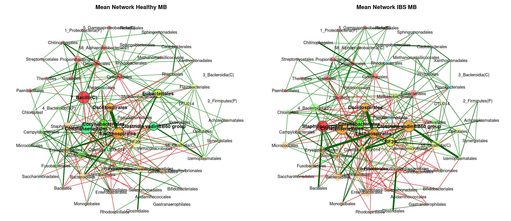<!-- --><!-- -->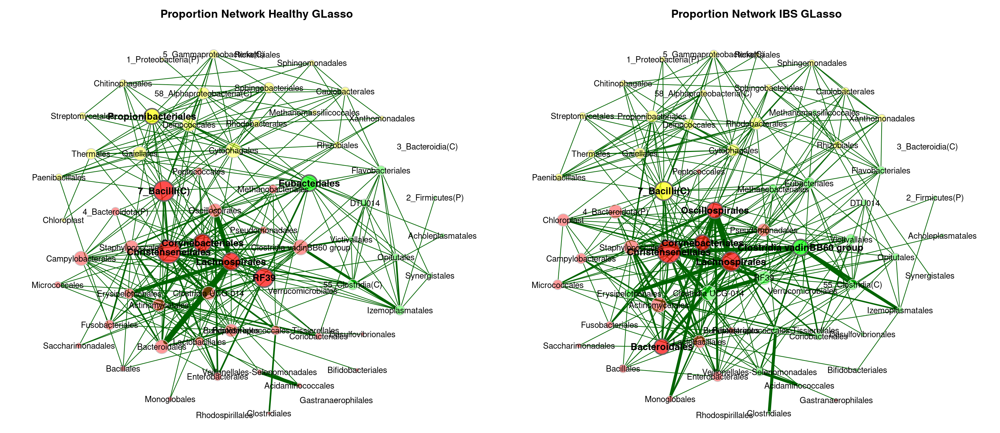<!-- -->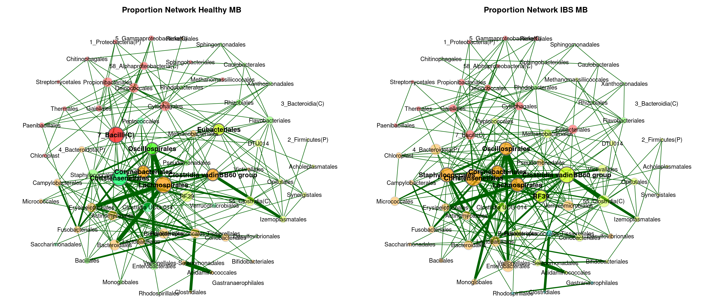<!-- --><!-- -->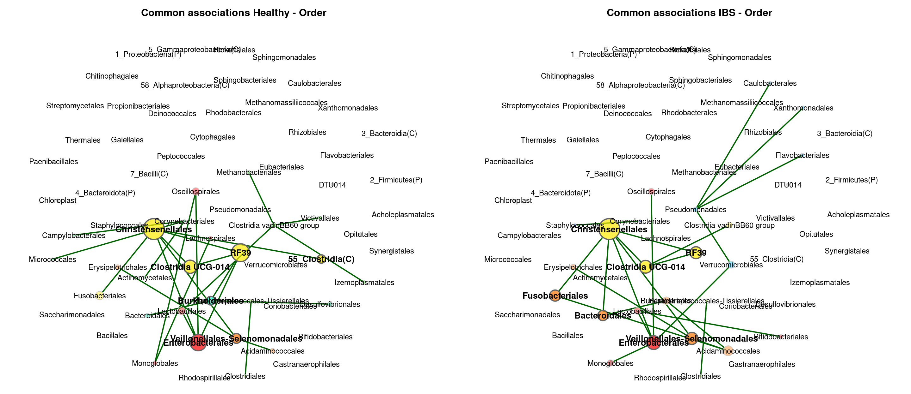<!-- -->

## 3.2. Individual Networks

<!-- --><!-- --><!-- --><!-- --><!-- --><!-- -->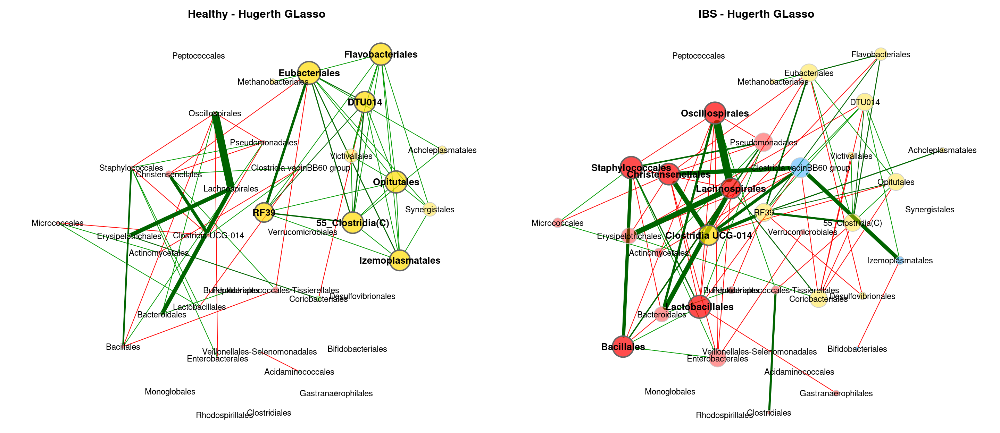<!-- --><!-- --><!-- --><!-- --><!-- --><!-- --><!-- --><!-- --><!-- --><!-- --><!-- -->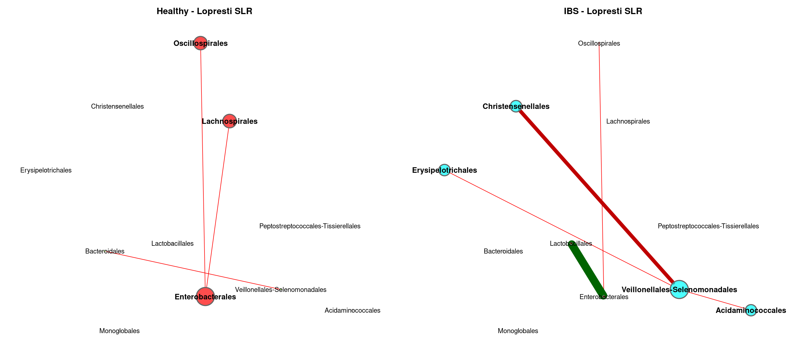<!-- -->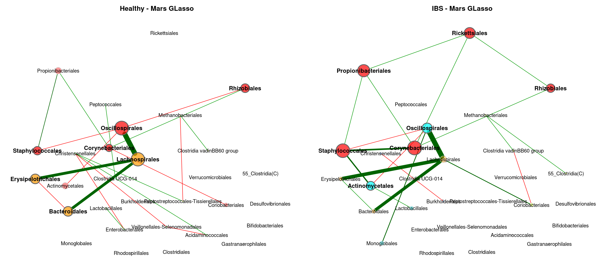<!-- --><!-- --><!-- --><!-- --><!-- --><!-- -->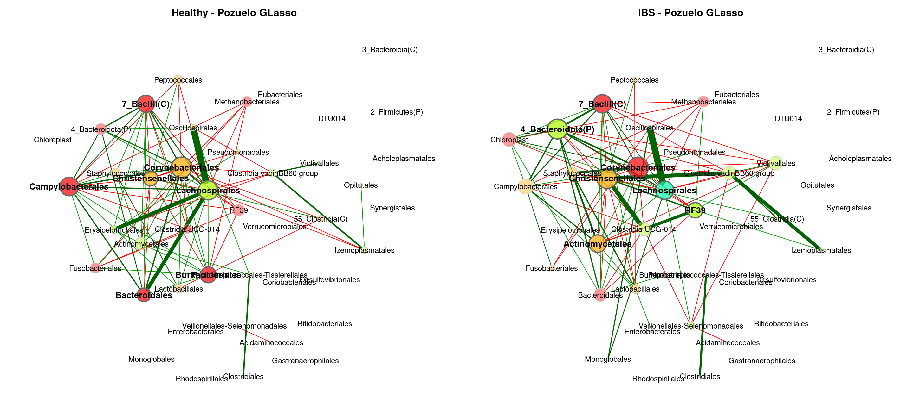<!-- --><!-- -->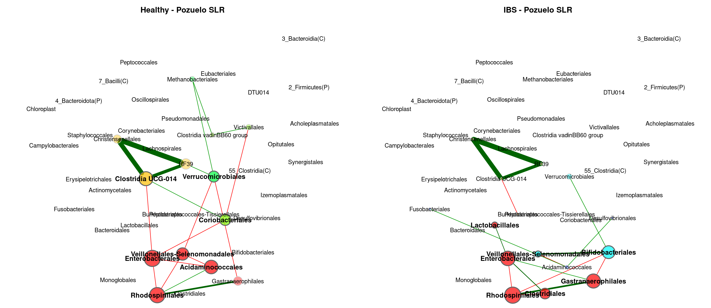<!-- -->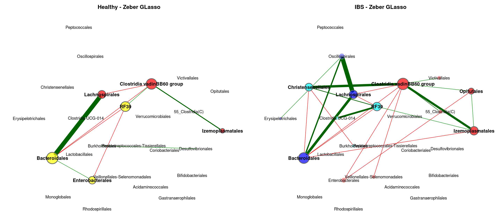<!-- -->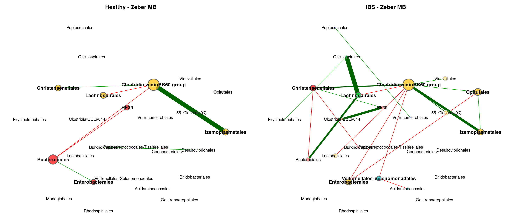<!-- --><!-- -->

    ## [1] "No connected nodes"
    ## [1] "No connected nodes"

<!-- --><!-- --><!-- --><!-- -->

## 3.3. Differential Networks

<!-- --><!-- --><!-- --><!-- --><!-- --><!-- --><!-- --><!-- --><!-- --><!-- --><!-- --><!-- --><!-- --><!-- --><!-- --><!-- --><!-- --><!-- -->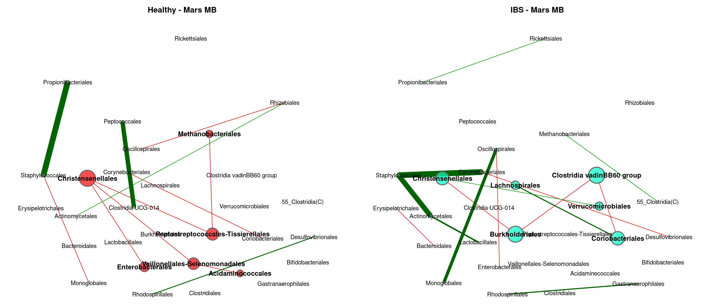<!-- -->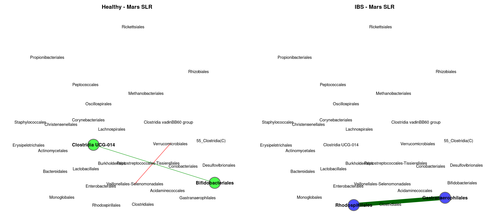<!-- --><!-- --><!-- --><!-- --><!-- --><!-- --><!-- --><!-- --><!-- --><!-- --><!-- --><!-- --><!-- -->

## 3.4. Global Properties

### 3.4.1. Summary

| Study | Method | Rel_LCC_H | Rel_LCC_IBS | Clustering_H | Clustering_IBS | Modularity_H | Modularity_IBS | Positive_Edges_H | Positive_Edges_IBS | Edge_Density_H | Edge_Density_IBS | Natural_Conn_H | Natural_Conn_IBS | Avg_Path_Length_H | Avg_Path_Length_IBS | Hubs_H | Hubs_IBS |
|:---|:---|---:|---:|---:|---:|---:|---:|---:|---:|---:|---:|---:|---:|---:|---:|:---|:---|
| agp | gl | 0.60938 | 0.64062 | 0.64427 | 0.71978 | 0.28320 | 0.41066 | 84.61538 | 84.61538 | 0.17544 | 0.17439 | 0.05133 | 0.04780 | 1.73572 | 1.70713 | 58_Alphaproteobacteria(C), 7_Bacilli(C), Cytophagales, Deinococcales, Gaiellales, Propionibacteriales, Thermales | 5_Gammaproteobacteria(C), 7_Bacilli(C), Cytophagales, Deinococcales, Gaiellales, Propionibacteriales, Rhodobacterales |
| fukui | gl | 0.24000 | 0.56000 | 0.42027 | 0.21060 | 0.20833 | 0.41992 | 33.33333 | 62.50000 | 0.40000 | 0.17582 | 0.25745 | 0.09829 | 1.39044 | 1.92779 | Bacteroidales, Christensenellales, Lachnospirales | Christensenellales, Clostridia UCG-014, Clostridia vadinBB60 group |
| hugerth | gl | 0.73684 | 0.84211 | 0.48349 | 0.42589 | 0.48262 | 0.41116 | 77.77778 | 52.56410 | 0.16667 | 0.15726 | 0.05348 | 0.04543 | 2.02165 | 1.72956 | 55_Clostridia(C), Eubacteriales, Flavobacteriales, Opitutales | 55_Clostridia(C), Clostridia UCG-014, Eubacteriales, RF39 |
| labus | gl | 0.20000 | 0.10000 | 0.00000 | 0.00000 | 0.00000 | 0.00000 | 0.00000 | 0.00000 | 1.00000 | 0.00000 | 0.79551 | 0.00000 | 0.71666 | 1.00000 |  |  |
| liu | gl | 0.32143 | 0.50000 | 0.69306 | 0.40900 | 0.14031 | 0.26125 | 50.00000 | 60.00000 | 0.38889 | 0.21978 | 0.16994 | 0.10113 | 1.22705 | 2.12501 | Christensenellales, RF39, Staphylococcales | Lachnospirales, Micrococcales, Pseudomonadales |
| lopresti | gl | 0.18182 | 0.27273 | 0.00000 | 0.00000 | 0.00000 | -0.12500 | 0.00000 | 0.00000 | 1.00000 | 0.66667 | 0.78735 | 0.55345 | 0.75820 | 0.95749 |  | Veillonellales-Selenomonadales |
| mars | gl | 0.33333 | 0.53333 | 0.29133 | 0.44726 | 0.37603 | 0.51875 | 63.63636 | 85.00000 | 0.24444 | 0.16667 | 0.14335 | 0.08554 | 1.68635 | 2.30686 | Bacteroidales, Lachnospirales, Oscillospirales | Corynebacteriales, Propionibacteriales, Staphylococcales |
| nagel | gl | 0.15000 | 0.10000 | 0.00000 | 0.00000 | -0.12500 | 0.00000 | 50.00000 | 100.00000 | 0.66667 | 1.00000 | 0.55684 | 0.80235 | 0.93526 | 0.68587 | Bifidobacteriales, Erysipelotrichales | Lactobacillales, Monoglobales |
| pozuelo | gl | 0.60465 | 0.62791 | 0.56199 | 0.58480 | 0.18515 | 0.14538 | 59.03614 | 55.43478 | 0.25538 | 0.26211 | 0.06622 | 0.06552 | 1.42159 | 1.41200 | 7_Bacilli(C), Burkholderiales, Campylobacterales, Corynebacteriales, Lachnospirales | 4_Bacteroidota(P), 7_Bacilli(C), Christensenellales, Corynebacteriales, Lachnospirales |
| zeber | gl | 0.23077 | 0.57692 | 0.69590 | 0.47317 | 0.11719 | 0.29395 | 50.00000 | 56.52174 | 0.53333 | 0.21905 | 0.26674 | 0.09414 | 1.08502 | 1.55463 | Bacteroidales, Clostridia vadinBB60 group, RF39 | Bacteroidales, Clostridia vadinBB60 group, Izemoplasmatales |
| zhuang | gl | 0.08333 | 0.16667 | 0.00000 | 0.00000 | 0.00000 | 0.00000 | 0.00000 | 0.00000 | 0.00000 | 1.00000 | 0.00000 | 0.78756 | 1.00000 | 0.75706 | , | Bifidobacteriales, Lactobacillales |
| agp | mb | 0.81250 | 0.90625 | 0.44203 | 0.35506 | 0.46549 | 0.53747 | 85.18519 | 87.50000 | 0.08145 | 0.07260 | 0.02637 | 0.02346 | 2.08147 | 2.34301 | 58_Alphaproteobacteria(C), 7_Bacilli(C), Christensenellales, Cytophagales, Deinococcales, Gaiellales, Propionibacteriales | 5_Gammaproteobacteria(C), 7_Bacilli(C), Cytophagales, Deinococcales, Gaiellales, Propionibacteriales, Rhodobacterales |
| fukui | mb | 0.16000 | 0.68000 | 0.00000 | 0.10144 | 0.16667 | 0.55190 | 33.33333 | 58.82353 | 0.50000 | 0.12500 | 0.40611 | 0.07761 | 1.19399 | 2.59024 | Bacteroidales, Christensenellales, Lachnospirales | Christensenellales, Clostridia UCG-014, Clostridia vadinBB60 group |
| hugerth | mb | 0.44737 | 0.89474 | 0.20712 | 0.33909 | 0.43079 | 0.47932 | 63.63636 | 64.40678 | 0.16176 | 0.10517 | 0.08012 | 0.03909 | 2.09171 | 2.04622 | Bacillales, Oscillospirales, Pseudomonadales, Staphylococcales | 55_Clostridia(C), Oscillospirales, RF39, Staphylococcales |
| labus | mb | 0.20000 | 0.20000 | 0.00000 | 0.00000 | 0.00000 | 0.00000 | 0.00000 | 0.00000 | 1.00000 | 1.00000 | 0.79432 | 0.79450 | 0.72236 | 0.72150 |  |  |
| liu | mb | 0.32143 | 0.50000 | 0.48517 | 0.25689 | 0.31405 | 0.41016 | 54.54545 | 62.50000 | 0.30556 | 0.17582 | 0.16334 | 0.09787 | 1.39837 | 2.35175 | Christensenellales, RF39, Staphylococcales | Chloroplast, Micrococcales, Oscillospirales |
| lopresti | mb | 0.18182 | 0.27273 | 0.00000 | 0.00000 | 0.00000 | -0.12500 | 0.00000 | 0.00000 | 1.00000 | 0.66667 | 0.78391 | 0.55266 | 0.77791 | 0.96319 |  | Veillonellales-Selenomonadales |
| mars | mb | 0.40000 | 0.70000 | 0.21122 | 0.31035 | 0.42899 | 0.57899 | 61.53846 | 70.83333 | 0.19697 | 0.11429 | 0.11630 | 0.06208 | 1.76398 | 2.71911 | Oscillospirales, Rhizobiales, Staphylococcales | Corynebacteriales, Oscillospirales, Staphylococcales |
| nagel | mb | 0.30000 | 0.10000 | 0.00000 | 0.00000 | 0.22000 | 0.00000 | 40.00000 | 100.00000 | 0.33333 | 1.00000 | 0.25539 | 0.80573 | 1.31205 | 0.67163 | Burkholderiales, Erysipelotrichales | Lactobacillales, Monoglobales |
| pozuelo | mb | 0.69767 | 0.76744 | 0.13991 | 0.26037 | 0.31266 | 0.33313 | 66.07143 | 56.25000 | 0.12874 | 0.12121 | 0.04492 | 0.04094 | 1.77808 | 1.87849 | 4_Bacteroidota(P), 7_Bacilli(C), Campylobacterales, Corynebacteriales, Lachnospirales | 4_Bacteroidota(P), Corynebacteriales, Lachnospirales, RF39, Victivallales |
| zeber | mb | 0.26923 | 0.65385 | 0.00000 | 0.27365 | 0.31944 | 0.44460 | 50.00000 | 57.89474 | 0.28571 | 0.13971 | 0.21201 | 0.07832 | 1.42852 | 1.83930 | Bacteroidales, Clostridia vadinBB60 group, Izemoplasmatales | Clostridia vadinBB60 group, Izemoplasmatales, Opitutales |
| zhuang | mb | 0.08333 | 0.16667 | 0.00000 | 0.00000 | 0.00000 | 0.00000 | 0.00000 | 0.00000 | 0.00000 | 1.00000 | 0.00000 | 0.78129 | 1.00000 | 0.79421 | , | Bifidobacteriales, Lactobacillales |
| agp | slr | 0.48438 | 0.35938 | 0.28311 | 0.42827 | 0.28338 | 0.43077 | 69.01408 | 76.74419 | 0.15269 | 0.16996 | 0.04529 | 0.05978 | 1.77857 | 1.75215 | Bifidobacteriales, Burkholderiales, Enterobacterales, Gastranaerophilales, Pseudomonadales, Veillonellales-Selenomonadales, Verrucomicrobiales | Acidaminococcales, Bifidobacteriales, Burkholderiales, Clostridiales, RF39, Rhodospirillales, Veillonellales-Selenomonadales |
| fukui | slr | 0.08000 | 0.36000 | 0.00000 | 0.43347 | 0.00000 | 0.40123 | 0.00000 | 66.66667 | 1.00000 | 0.25000 | 0.79049 | 0.16029 | 0.74148 | 1.65532 | Christensenellales, Fusobacteriales, | Acidaminococcales, Burkholderiales, Enterobacterales |
| hugerth | slr | 0.05263 | 0.15789 | 0.00000 | 0.71582 | 0.00000 | 0.07143 | 100.00000 | 57.14286 | 1.00000 | 0.46667 | 0.79831 | 0.26327 | 0.70370 | 1.08188 | Christensenellales, Clostridia UCG-014, , | Christensenellales, Enterobacterales, Lactobacillales, Verrucomicrobiales |
| labus | slr | 0.50000 | 0.20000 | 0.00000 | 0.00000 | 0.21875 | 0.00000 | 25.00000 | 100.00000 | 0.40000 | 1.00000 | 0.31490 | 0.79833 | 1.41371 | 0.70358 | Erysipelotrichales |  |
| liu | slr | 0.14286 | 0.50000 | 0.00000 | 0.07737 | -0.05556 | 0.38927 | 66.66667 | 41.17647 | 0.50000 | 0.18681 | 0.41226 | 0.09758 | 1.01719 | 1.79458 | Christensenellales, Clostridia UCG-014, RF39 | Burkholderiales, Enterobacterales, Veillonellales-Selenomonadales |
| lopresti | slr | 0.27273 | 0.36364 | 0.00000 | 0.00000 | -0.12500 | -0.05556 | 0.00000 | 33.33333 | 0.66667 | 0.50000 | 0.54701 | 0.40465 | 1.00648 | 1.08293 | Enterobacterales | Veillonellales-Selenomonadales |
| mars | slr | 0.06667 | 0.06667 | 0.00000 | 0.00000 | 0.00000 | 0.00000 | 100.00000 | 100.00000 | 1.00000 | 1.00000 | 0.80088 | 0.79934 | 0.69221 | 0.69904 | Bifidobacteriales, Clostridia UCG-014 | Gastranaerophilales, Rhodospirillales |
| nagel | slr | 0.15000 | 0.35000 | 0.00000 | 0.00000 | -0.12500 | 0.29167 | 100.00000 | 50.00000 | 0.66667 | 0.28571 | 0.55814 | 0.21262 | 0.92625 | 1.49181 | Clostridiales, Peptostreptococcales-Tissierellales | Veillonellales-Selenomonadales, Verrucomicrobiales |
| pozuelo | slr | 0.30233 | 0.34884 | 0.28249 | 0.43360 | 0.33934 | 0.35728 | 52.63158 | 56.52174 | 0.24359 | 0.21905 | 0.10818 | 0.09262 | 1.59716 | 1.69572 | Acidaminococcales, Clostridia UCG-014, Enterobacterales, Rhodospirillales, Veillonellales-Selenomonadales | Bifidobacteriales, Clostridia UCG-014, Clostridiales, Gastranaerophilales, Rhodospirillales |
| zeber | slr | 0.07692 | 0.11538 | 0.00000 | 0.00000 | 0.00000 | -0.12500 | 100.00000 | 0.00000 | 1.00000 | 0.66667 | 0.79843 | 0.55508 | 0.70315 | 0.94628 | Christensenellales, Rhodospirillales, | Bifidobacteriales, Peptostreptococcales-Tissierellales, Rhodospirillales |
| zhu | slr | 0.36364 | 0.18182 | 0.00000 | 0.00000 | 0.16667 | 0.00000 | 66.66667 | 0.00000 | 0.50000 | 1.00000 | 0.40697 | 0.78565 | 1.17655 | 0.76779 | Monoglobales |  |
| zhuang | slr | 0.16667 | 0.16667 | 0.00000 | 0.00000 | 0.00000 | 0.00000 | 100.00000 | 0.00000 | 1.00000 | 1.00000 | 0.79805 | 0.79688 | 0.70487 | 0.71022 | Acidaminococcales, Fusobacteriales | Acidaminococcales, Fusobacteriales |

### 3.4.2 Summary Plots

<!-- --><!-- --><!-- --><!-- --><!-- -->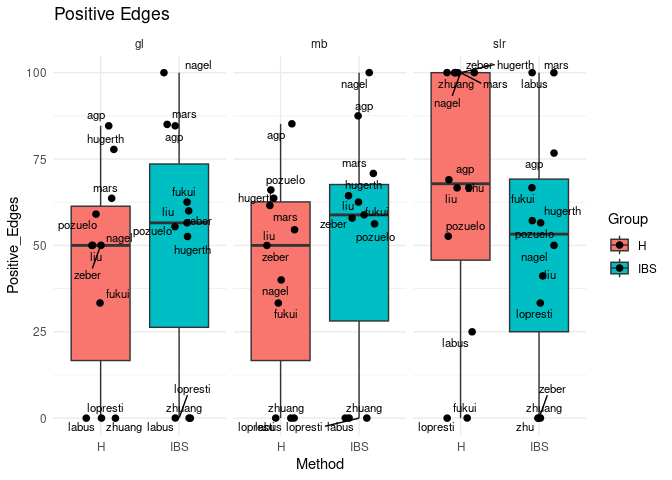<!-- -->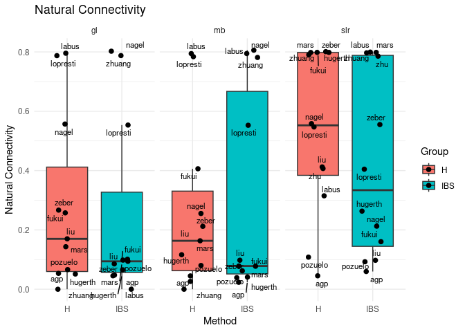<!-- -->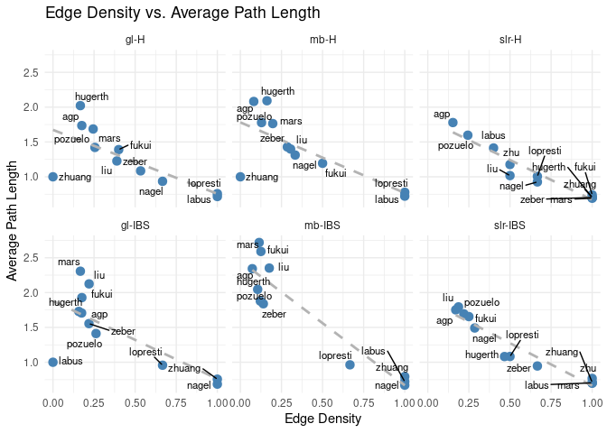<!-- -->

### 3.4.3. Hubs

<!-- -->

<!-- -->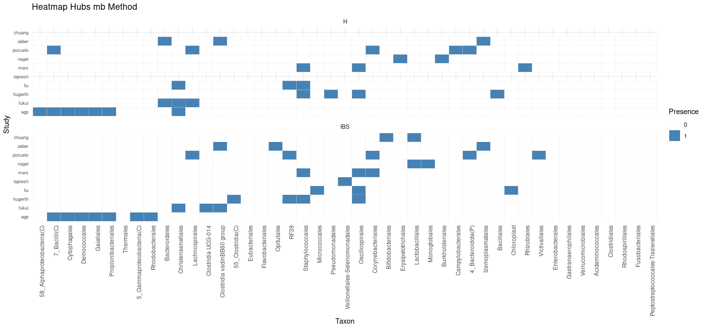<!-- -->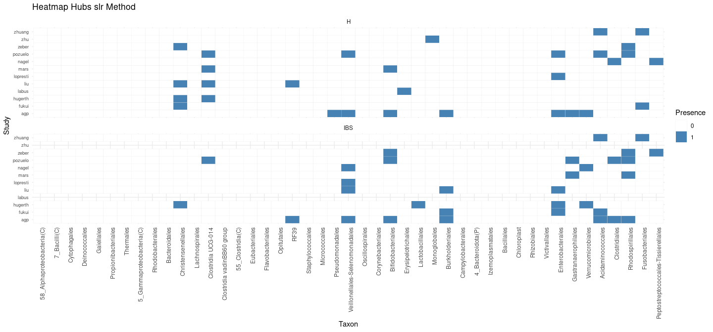<!-- --><!-- -->
