Meta Analysis - Network Comparison (Order)
================
2024-03-01

``` r
myPaths <- .libPaths()
myPaths <- c(myPaths, "~/MetaIBS/MetaIBS-library")
myPaths <- c(myPaths[3], myPaths[1], myPaths[2])
.libPaths(myPaths)  # add new path
```

------------------------------------------------------------------------

# 1. IMPORT

------------------------------------------------------------------------

## 1.1. Libraries

``` r
library(phyloseq) # Handling and analysis of high-throughput microbiome census data.
library(tidyverse)
library(ggplot2)
library(SpiecEasi)
library(igraph)
library(VennDiagram)
library(NetCoMi)
```

------------------------------------------------------------------------

# 2. FUNCTIONS

------------------------------------------------------------------------

------------------------------------------------------------------------

# 3. META-ANALYSIS

------------------------------------------------------------------------

## 3.1. Summary Plots

<!-- --><!-- -->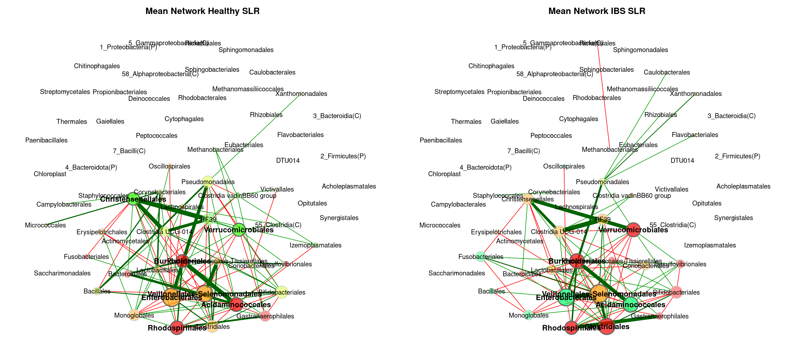<!-- --><!-- --><!-- -->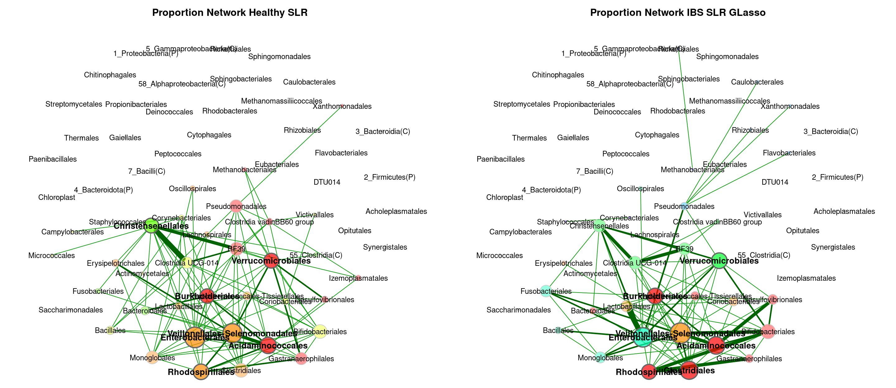<!-- --><!-- -->

## 3.2. Individual Plots

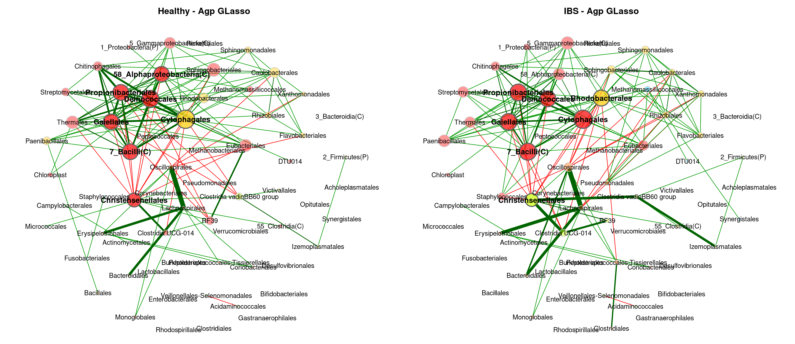<!-- -->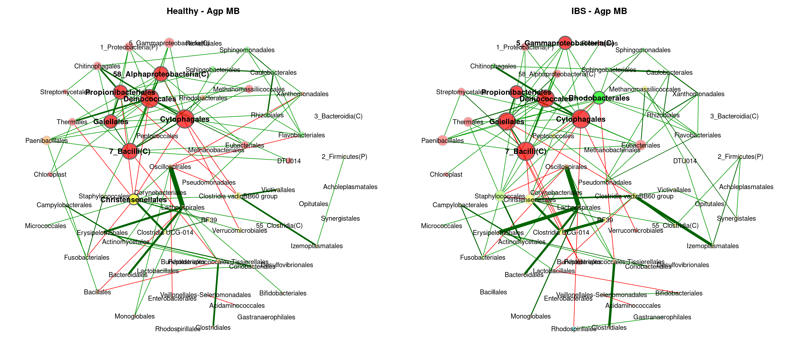<!-- -->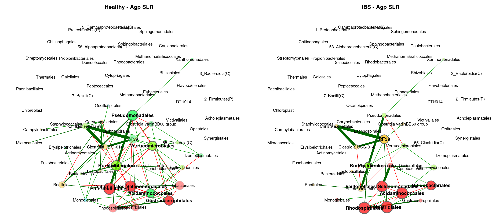<!-- -->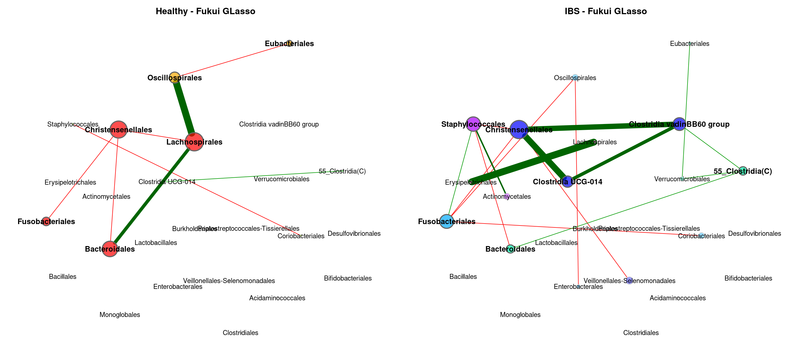<!-- -->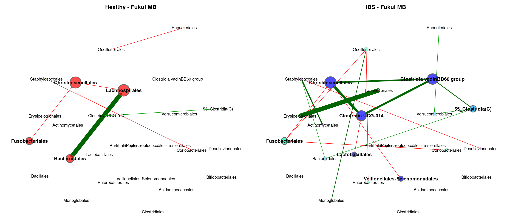<!-- --><!-- --><!-- --><!-- -->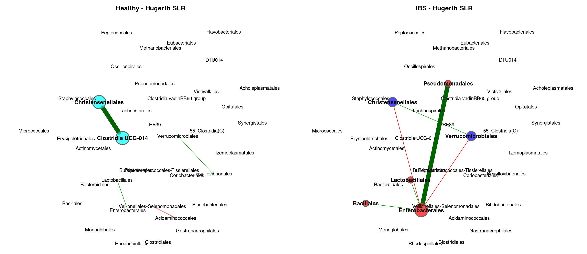<!-- --><!-- --><!-- --><!-- -->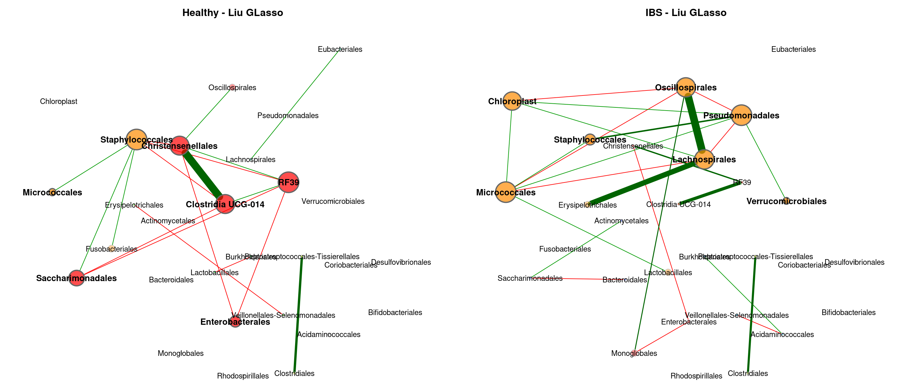<!-- --><!-- --><!-- --><!-- --><!-- --><!-- --><!-- -->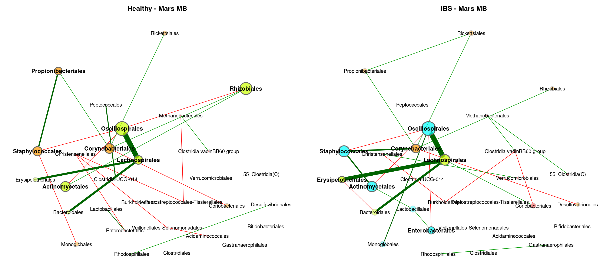<!-- -->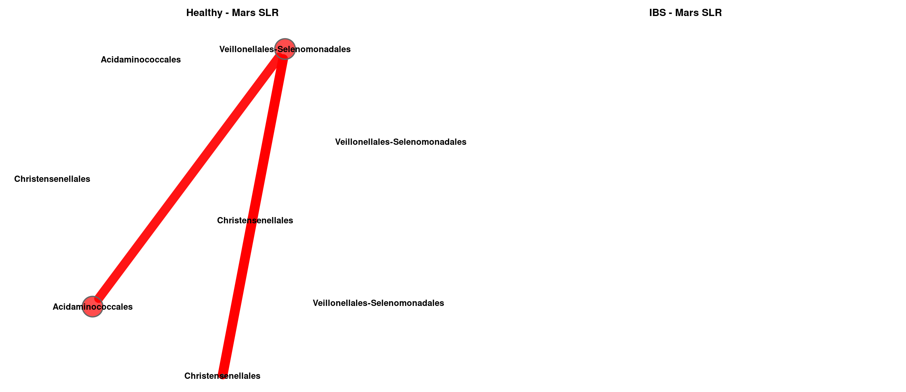<!-- --><!-- --><!-- -->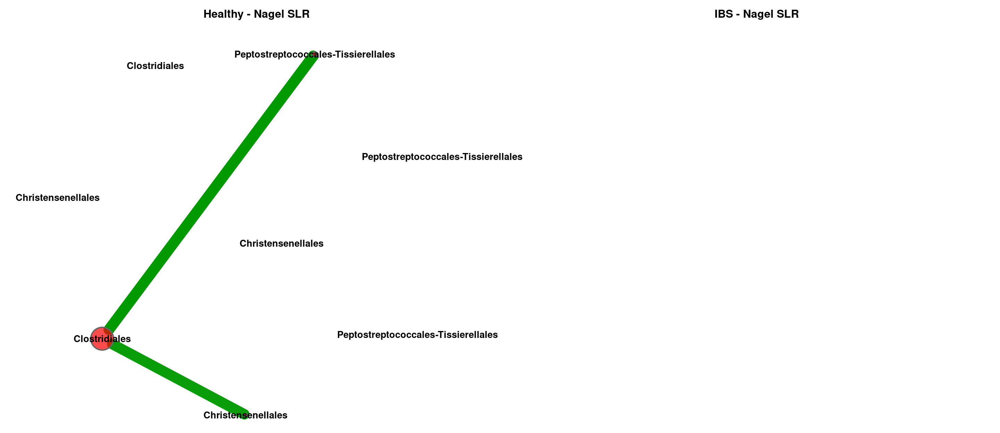<!-- --><!-- --><!-- --><!-- --><!-- --><!-- --><!-- -->

    ## [1] "No connected nodes"
    ## [1] "No connected nodes"

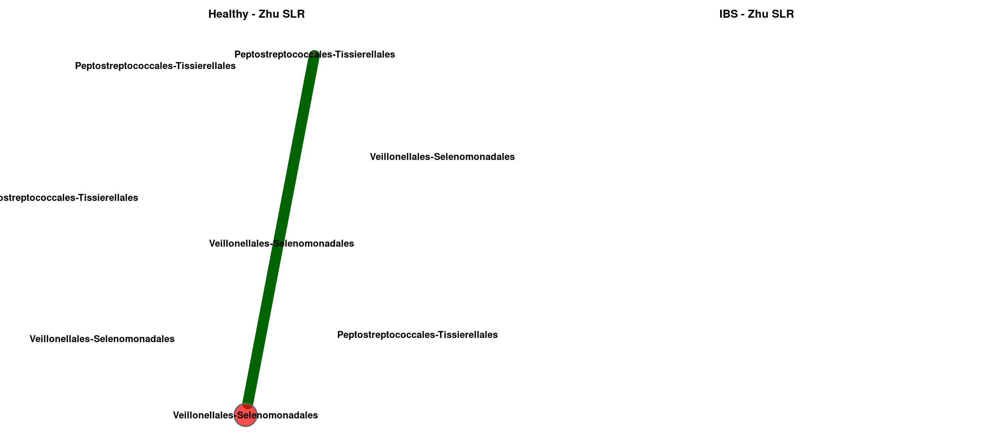<!-- --><!-- --><!-- --><!-- -->

## 3.3. Global Properties

### 3.3.1. GLasso

|  | agp.Healthy | agp.IBS | fukui.Healthy | fukui.IBS | hugerth.Healthy | hugerth.IBS | labus.Healthy | labus.IBS | liu.Healthy | liu.IBS | lopresti.Healthy | lopresti.IBS | mars.Healthy | mars.IBS | nagel.Healthy | nagel.IBS | pozuelo.Healthy | pozuelo.IBS | zeber.Healthy | zeber.IBS | zhuang.Healthy | zhuang.IBS |
|:---|---:|---:|---:|---:|---:|---:|---:|---:|---:|---:|---:|---:|---:|---:|---:|---:|---:|---:|---:|---:|---:|---:|
| Relative LCC size | 0.64062 | 0.67188 | 0.24000 | 0.56000 | 0.73684 | 0.84211 | 0.20000 | 0.1 | 0.32143 | 0.50000 | 0.18182 | 0.27273 | 0.33333 | 0.53333 | 0.15000 | 0.10000 | 0.60465 | 0.62791 | 0.23077 | 0.57692 | 0.08333 | 0.16667 |
| Clustering coefficient | 0.62290 | 0.67587 | 0.42027 | 0.21060 | 0.48349 | 0.42589 | 0.00000 | 0.0 | 0.69306 | 0.40900 | 0.00000 | 0.00000 | 0.29133 | 0.44726 | 0.00000 | 0.00000 | 0.56199 | 0.58480 | 0.69590 | 0.47317 | 0.00000 | 0.00000 |
| Modularity | 0.28842 | 0.39692 | 0.20833 | 0.41992 | 0.48262 | 0.41116 | 0.00000 | 0.0 | 0.14031 | 0.26125 | 0.00000 | -0.12500 | 0.37603 | 0.51875 | -0.12500 | 0.00000 | 0.18515 | 0.14538 | 0.11719 | 0.29395 | 0.00000 | 0.00000 |
| Positive edge percentage | 84.09091 | 83.33333 | 33.33333 | 62.50000 | 77.77778 | 52.56410 | 0.00000 | 0.0 | 50.00000 | 60.00000 | 0.00000 | 0.00000 | 63.63636 | 85.00000 | 50.00000 | 100.00000 | 59.03614 | 55.43478 | 50.00000 | 56.52174 | 0.00000 | 0.00000 |
| Edge density | 0.16098 | 0.17276 | 0.40000 | 0.17582 | 0.16667 | 0.15726 | 1.00000 | 0.0 | 0.38889 | 0.21978 | 1.00000 | 0.66667 | 0.24444 | 0.16667 | 0.66667 | 1.00000 | 0.25538 | 0.26211 | 0.53333 | 0.21905 | 0.00000 | 1.00000 |
| Natural connectivity | 0.04811 | 0.04783 | 0.25745 | 0.09829 | 0.05348 | 0.04543 | 0.79551 | 0.0 | 0.16994 | 0.10113 | 0.78735 | 0.55345 | 0.14335 | 0.08554 | 0.55684 | 0.80235 | 0.06622 | 0.06552 | 0.26674 | 0.09414 | 0.00000 | 0.78756 |
| Vertex connectivity | 1.00000 | 1.00000 | 1.00000 | 1.00000 | 1.00000 | 1.00000 | 1.00000 | 0.0 | 1.00000 | 1.00000 | 1.00000 | 1.00000 | 1.00000 | 1.00000 | 1.00000 | 1.00000 | 1.00000 | 1.00000 | 1.00000 | 1.00000 | 0.00000 | 1.00000 |
| Edge connectivity | 1.00000 | 1.00000 | 1.00000 | 1.00000 | 1.00000 | 1.00000 | 1.00000 | 0.0 | 1.00000 | 1.00000 | 1.00000 | 1.00000 | 1.00000 | 1.00000 | 1.00000 | 1.00000 | 1.00000 | 1.00000 | 1.00000 | 1.00000 | 0.00000 | 1.00000 |
| Average dissimilarity\* | 0.67082 | 0.66974 | 0.71716 | 0.68892 | 0.68474 | 0.69341 | 0.71666 | 1.0 | 0.70599 | 0.70075 | 0.75820 | 0.71811 | 0.69573 | 0.68593 | 0.70145 | 0.68587 | 0.69489 | 0.70000 | 0.70936 | 0.69916 | 1.00000 | 0.75706 |
| Average path length\*\* | 1.78276 | 1.69761 | 1.39044 | 1.92779 | 2.02165 | 1.72956 | 0.71666 | 1.0 | 1.22705 | 2.12501 | 0.75820 | 0.95749 | 1.68635 | 2.30686 | 0.93526 | 0.68587 | 1.42159 | 1.41200 | 1.08502 | 1.55463 | 1.00000 | 0.75706 |

### 3.3.2 MB

|  | agp.Healthy | agp.IBS | fukui.Healthy | fukui.IBS | hugerth.Healthy | hugerth.IBS | labus.Healthy | labus.IBS | liu.Healthy | liu.IBS | lopresti.Healthy | lopresti.IBS | mars.Healthy | mars.IBS | nagel.Healthy | nagel.IBS | pozuelo.Healthy | pozuelo.IBS | zeber.Healthy | zeber.IBS | zhuang.Healthy | zhuang.IBS |
|:---|---:|---:|---:|---:|---:|---:|---:|---:|---:|---:|---:|---:|---:|---:|---:|---:|---:|---:|---:|---:|---:|---:|
| Relative LCC size | 0.81250 | 0.79688 | 0.16000 | 0.68000 | 0.44737 | 0.89474 | 0.20000 | 0.2000 | 0.32143 | 0.50000 | 0.18182 | 0.27273 | 0.40000 | 0.70000 | 0.30000 | 0.10000 | 0.69767 | 0.76744 | 0.26923 | 0.65385 | 0.08333 | 0.16667 |
| Clustering coefficient | 0.43898 | 0.43438 | 0.00000 | 0.10144 | 0.20712 | 0.33909 | 0.00000 | 0.0000 | 0.48517 | 0.25689 | 0.00000 | 0.00000 | 0.21122 | 0.31035 | 0.00000 | 0.00000 | 0.13991 | 0.26037 | 0.00000 | 0.27365 | 0.00000 | 0.00000 |
| Modularity | 0.45779 | 0.52740 | 0.16667 | 0.55190 | 0.43079 | 0.47932 | 0.00000 | 0.0000 | 0.31405 | 0.41016 | 0.00000 | -0.12500 | 0.42899 | 0.57899 | 0.22000 | 0.00000 | 0.31266 | 0.33313 | 0.31944 | 0.44460 | 0.00000 | 0.00000 |
| Positive edge percentage | 84.40367 | 90.09901 | 33.33333 | 58.82353 | 63.63636 | 64.40678 | 0.00000 | 0.0000 | 54.54545 | 62.50000 | 0.00000 | 0.00000 | 61.53846 | 70.83333 | 40.00000 | 100.00000 | 66.07143 | 56.25000 | 50.00000 | 57.89474 | 0.00000 | 0.00000 |
| Edge density | 0.08220 | 0.07922 | 0.50000 | 0.12500 | 0.16176 | 0.10517 | 1.00000 | 1.0000 | 0.30556 | 0.17582 | 1.00000 | 0.66667 | 0.19697 | 0.11429 | 0.33333 | 1.00000 | 0.12874 | 0.12121 | 0.28571 | 0.13971 | 0.00000 | 1.00000 |
| Natural connectivity | 0.02644 | 0.02670 | 0.40611 | 0.07761 | 0.08012 | 0.03909 | 0.79432 | 0.7945 | 0.16334 | 0.09787 | 0.78391 | 0.55266 | 0.11630 | 0.06208 | 0.25539 | 0.80573 | 0.04492 | 0.04094 | 0.21201 | 0.07832 | 0.00000 | 0.78129 |
| Vertex connectivity | 1.00000 | 1.00000 | 1.00000 | 1.00000 | 1.00000 | 1.00000 | 1.00000 | 1.0000 | 1.00000 | 1.00000 | 1.00000 | 1.00000 | 1.00000 | 1.00000 | 1.00000 | 1.00000 | 1.00000 | 1.00000 | 1.00000 | 1.00000 | 0.00000 | 1.00000 |
| Edge connectivity | 1.00000 | 1.00000 | 1.00000 | 1.00000 | 1.00000 | 1.00000 | 1.00000 | 1.0000 | 1.00000 | 1.00000 | 1.00000 | 1.00000 | 1.00000 | 1.00000 | 1.00000 | 1.00000 | 1.00000 | 1.00000 | 1.00000 | 1.00000 | 0.00000 | 1.00000 |
| Average dissimilarity\* | 0.68484 | 0.68096 | 0.71604 | 0.69067 | 0.68481 | 0.68581 | 0.72236 | 0.7215 | 0.70433 | 0.69085 | 0.77791 | 0.72240 | 0.68921 | 0.68821 | 0.70007 | 0.67163 | 0.69542 | 0.69683 | 0.71110 | 0.69372 | 1.00000 | 0.79421 |
| Average path length\*\* | 2.06277 | 2.23460 | 1.19399 | 2.59024 | 2.09171 | 2.04622 | 0.72236 | 0.7215 | 1.39837 | 2.35175 | 0.77791 | 0.96319 | 1.76398 | 2.71911 | 1.31205 | 0.67163 | 1.77808 | 1.87849 | 1.42852 | 1.83930 | 1.00000 | 0.79421 |

### 3.3.3. SLR

|  | agp.Healthy | agp.IBS | fukui.Healthy | fukui.IBS | hugerth.Healthy | hugerth.IBS | labus.Healthy | labus.IBS | liu.Healthy | liu.IBS | lopresti.Healthy | lopresti.IBS | mars.Healthy | mars.IBS | nagel.Healthy | nagel.IBS | pozuelo.Healthy | pozuelo.IBS | zeber.Healthy | zeber.IBS | zhuang.Healthy | zhuang.IBS |
|:---|---:|---:|---:|---:|---:|---:|---:|---:|---:|---:|---:|---:|---:|---:|---:|---:|---:|---:|---:|---:|---:|---:|
| Relative LCC size | 0.50000 | 0.56250 | 0.08000 | 0.48000 | 0.55263 | 0.57895 | 0.40000 | 0.20000 | 0.07143 | 0.64286 | 0.27273 | 0.27273 | 0.16667 | 0.06667 | 0.15000 | 0.10000 | 0.53488 | 0.44186 | 0.11538 | 0.15385 | 0.16667 | 0.16667 |
| Clustering coefficient | 0.35724 | 0.44139 | 0.00000 | 0.16636 | 0.00000 | 0.00000 | 0.00000 | 0.00000 | 0.00000 | 0.42431 | 0.00000 | 0.00000 | 0.58584 | 0.00000 | 0.00000 | 0.00000 | 0.07896 | 0.37900 | 0.00000 | 0.00000 | 0.00000 | 0.00000 |
| Modularity | 0.28175 | 0.53174 | 0.00000 | 0.35778 | 0.59375 | 0.52951 | 0.16667 | 0.00000 | 0.00000 | 0.43565 | -0.12500 | -0.12500 | 0.22000 | 0.00000 | -0.12500 | 0.00000 | 0.44722 | 0.33434 | -0.12500 | 0.16667 | 0.00000 | 0.00000 |
| Positive edge percentage | 67.07317 | 64.78873 | 0.00000 | 60.00000 | 70.00000 | 62.50000 | 0.00000 | 100.00000 | 0.00000 | 42.30769 | 0.00000 | 0.00000 | 80.00000 | 0.00000 | 100.00000 | 100.00000 | 63.33333 | 58.82353 | 100.00000 | 66.66667 | 100.00000 | 0.00000 |
| Edge density | 0.16532 | 0.11270 | 1.00000 | 0.22727 | 0.09524 | 0.10390 | 0.50000 | 1.00000 | 1.00000 | 0.16993 | 0.66667 | 0.66667 | 0.50000 | 1.00000 | 0.66667 | 1.00000 | 0.11858 | 0.19883 | 0.66667 | 0.50000 | 1.00000 | 1.00000 |
| Natural connectivity | 0.04492 | 0.03718 | 0.78411 | 0.11673 | 0.06049 | 0.05808 | 0.40555 | 0.79886 | 0.77835 | 0.07484 | 0.55154 | 0.55137 | 0.32311 | 0.79195 | 0.55776 | 0.80024 | 0.05628 | 0.07258 | 0.55589 | 0.41195 | 0.79936 | 0.78549 |
| Vertex connectivity | 1.00000 | 1.00000 | 1.00000 | 1.00000 | 1.00000 | 1.00000 | 1.00000 | 1.00000 | 1.00000 | 1.00000 | 1.00000 | 1.00000 | 1.00000 | 1.00000 | 1.00000 | 1.00000 | 1.00000 | 1.00000 | 1.00000 | 1.00000 | 1.00000 | 1.00000 |
| Edge connectivity | 1.00000 | 1.00000 | 1.00000 | 1.00000 | 1.00000 | 1.00000 | 1.00000 | 1.00000 | 1.00000 | 1.00000 | 1.00000 | 1.00000 | 1.00000 | 1.00000 | 1.00000 | 1.00000 | 1.00000 | 1.00000 | 1.00000 | 1.00000 | 1.00000 | 1.00000 |
| Average dissimilarity\* | 0.70244 | 0.69776 | 0.77675 | 0.70519 | 0.69868 | 0.69903 | 0.71515 | 0.70118 | 0.81408 | 0.70893 | 0.72868 | 0.72902 | 0.69721 | 0.73401 | 0.69651 | 0.69505 | 0.70033 | 0.70738 | 0.70560 | 0.68122 | 0.69897 | 0.76865 |
| Average path length\*\* | 1.62684 | 2.15352 | 0.77675 | 1.73799 | 3.05736 | 2.92145 | 1.19264 | 0.70118 | 0.81408 | 2.02944 | 0.97157 | 0.97203 | 1.19139 | 0.73401 | 0.92867 | 0.69505 | 2.22893 | 1.68319 | 0.94080 | 1.13967 | 0.69897 | 0.76865 |
