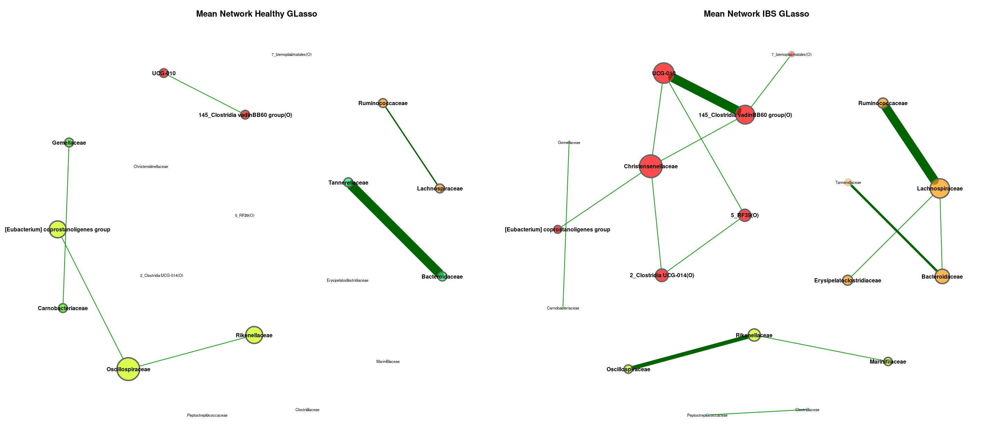
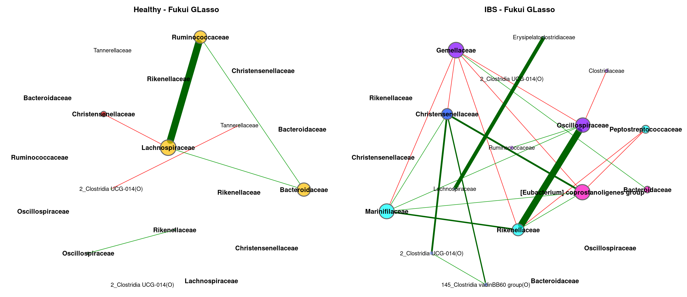

Meta Analysis - Network Comparison (Family)
================
2024-03-01

``` r
myPaths <- .libPaths()
myPaths <- c(myPaths, "~/MetaIBS/MetaIBS-library")
myPaths <- c(myPaths[3], myPaths[1], myPaths[2])
.libPaths(myPaths)  # add new path
```

------------------------------------------------------------------------

# 1. IMPORT

------------------------------------------------------------------------

## 1.1. Libraries

``` r
library(phyloseq) # Handling and analysis of high-throughput microbiome census data.
library(tidyverse)
library(ggplot2)
library(SpiecEasi)
library(igraph)
library(VennDiagram)
library(NetCoMi)
```

------------------------------------------------------------------------

# 2. META-ANALYSIS

------------------------------------------------------------------------

## GLasso

### Meta-Analysis Plot

<!-- -->

### Individual Plots

<!-- --><!-- --><!-- --><!-- --><!-- --><!-- --><!-- --><!-- --><!-- --><!-- --><!-- --><!-- -->

### Global Properties

|  | agp.group ’’ | agp.group ’’ | fukui.group ’’ | fukui.group ’’ | hugerth.group ’’ | hugerth.group ’’ | labus.group ’’ | labus.group ’’ | liu.group ’’ | liu.group ’’ | lopresti.group ’’ | lopresti.group ’’ | mars.group ’’ | mars.group ’’ | nagel.group ’’ | nagel.group ’’ | pozuelo.group ’’ | pozuelo.group ’’ | zeber.group ’’ | zeber.group ’’ | zhu.group ’’ | zhu.group ’’ | zhuang.group ’’ | zhuang.group ’’ |
|:---|---:|---:|---:|---:|---:|---:|---:|---:|---:|---:|---:|---:|---:|---:|---:|---:|---:|---:|---:|---:|---:|---:|---:|---:|
| Relative LCC size | 0.64167 | 0.70000 | 0.27907 | 0.76744 | 0.75000 | 0.76471 | 0.23529 | 0.17647 | 0.65957 | 0.78723 | 0.28571 | 0.21429 | 0.56250 | 0.66667 | 0.40000 | 0.26667 | 0.76543 | 0.80247 | 0.25000 | 0.68182 | 0.11111 | 0.22222 | 0.11765 | 0.11765 |
| Clustering coefficient | 0.65763 | 0.65940 | 0.47581 | 0.32448 | 0.63247 | 0.50319 | 0.00000 | 1.00000 | 0.31650 | 0.46686 | 0.77762 | 0.00000 | 0.51686 | 0.34097 | 0.57154 | 0.00000 | 0.35523 | 0.54353 | 0.51340 | 0.33655 | 0.00000 | 0.00000 | 0.00000 | 0.00000 |
| Modularity | 0.28951 | 0.41125 | 0.35333 | 0.32987 | 0.46510 | 0.44714 | 0.16667 | -0.22222 | 0.48914 | 0.41412 | 0.00000 | -0.12500 | 0.56057 | 0.54717 | 0.22375 | 0.35714 | 0.26551 | 0.25829 | 0.30357 | 0.32414 | 0.00000 | -0.05556 | 0.00000 | 0.00000 |
| Positive edge percentage | 82.02247 | 86.66667 | 66.66667 | 53.62319 | 82.06522 | 64.70588 | 0.00000 | 33.33333 | 55.31915 | 58.22785 | 25.00000 | 50.00000 | 65.11628 | 75.47170 | 45.00000 | 71.42857 | 59.79899 | 57.30337 | 57.14286 | 52.83019 | 100.00000 | 33.33333 | 0.00000 | 0.00000 |
| Edge density | 0.12167 | 0.10757 | 0.22727 | 0.13068 | 0.14431 | 0.14103 | 0.50000 | 1.00000 | 0.10108 | 0.11862 | 0.66667 | 0.66667 | 0.12251 | 0.10685 | 0.30303 | 0.25000 | 0.10524 | 0.12837 | 0.25455 | 0.12184 | 1.00000 | 0.50000 | 1.00000 | 1.00000 |
| Natural connectivity | 0.03856 | 0.03213 | 0.11819 | 0.04203 | 0.03676 | 0.03214 | 0.40466 | 0.57332 | 0.04195 | 0.03774 | 0.41658 | 0.55484 | 0.04895 | 0.04147 | 0.12191 | 0.18216 | 0.02713 | 0.03326 | 0.13047 | 0.04558 | 0.80256 | 0.40623 | 0.79518 | 0.79756 |
| Vertex connectivity | 1.00000 | 1.00000 | 1.00000 | 1.00000 | 1.00000 | 1.00000 | 1.00000 | 2.00000 | 1.00000 | 1.00000 | 1.00000 | 1.00000 | 1.00000 | 1.00000 | 1.00000 | 1.00000 | 1.00000 | 1.00000 | 1.00000 | 1.00000 | 1.00000 | 1.00000 | 1.00000 | 1.00000 |
| Edge connectivity | 1.00000 | 1.00000 | 1.00000 | 1.00000 | 1.00000 | 1.00000 | 1.00000 | 2.00000 | 1.00000 | 1.00000 | 1.00000 | 1.00000 | 1.00000 | 1.00000 | 1.00000 | 1.00000 | 1.00000 | 1.00000 | 1.00000 | 1.00000 | 1.00000 | 1.00000 | 1.00000 | 1.00000 |
| Average dissimilarity\* | 0.67705 | 0.67748 | 0.70183 | 0.69982 | 0.67880 | 0.68705 | 0.72100 | 0.70988 | 0.69577 | 0.69454 | 0.71045 | 0.71188 | 0.70023 | 0.68846 | 0.70995 | 0.69885 | 0.69838 | 0.69653 | 0.70207 | 0.69527 | 0.68497 | 0.71164 | 0.71823 | 0.70711 |
| Average path length\*\* | 1.77673 | 1.88639 | 1.81299 | 2.13550 | 1.85192 | 1.69468 | 1.20449 | 0.70988 | 2.24130 | 2.17638 | 0.95566 | 0.94918 | 2.17506 | 2.51111 | 1.44881 | 1.67495 | 1.98430 | 1.90914 | 1.50925 | 1.86579 | 0.68497 | 1.06747 | 0.71823 | 0.70711 |

## MB

### Meta-Analysis Plot

<!-- -->

### Individual Plots

<!-- --><!-- --><!-- --><!-- --><!-- --><!-- --><!-- --><!-- --><!-- --><!-- --><!-- --><!-- -->

### Global Properties

|  | agp.group ’’ | agp.group ’’ | fukui.group ’’ | fukui.group ’’ | hugerth.group ’’ | hugerth.group ’’ | labus.group ’’ | labus.group ’’ | liu.group ’’ | liu.group ’’ | lopresti.group ’’ | lopresti.group ’’ | mars.group ’’ | mars.group ’’ | nagel.group ’’ | nagel.group ’’ | pozuelo.group ’’ | pozuelo.group ’’ | zeber.group ’’ | zeber.group ’’ | zhu.group ’’ | zhu.group ’’ | zhuang.group ’’ | zhuang.group ’’ |
|:---|---:|---:|---:|---:|---:|---:|---:|---:|---:|---:|---:|---:|---:|---:|---:|---:|---:|---:|---:|---:|---:|---:|---:|---:|
| Relative LCC size | 0.95000 | 0.93333 | 0.44186 | 0.88372 | 0.86765 | 0.94118 | 0.23529 | 0.17647 | 0.76596 | 0.82979 | 0.28571 | 0.21429 | 0.89583 | 0.93750 | 0.53333 | 0.26667 | 0.93827 | 0.93827 | 0.18182 | 0.86364 | 0.11111 | 0.22222 | 0.17647 | 0.11765 |
| Clustering coefficient | 0.33750 | 0.35249 | 0.26484 | 0.21520 | 0.38306 | 0.27180 | 0.00000 | 0.00000 | 0.05822 | 0.18493 | 0.00000 | 0.00000 | 0.18506 | 0.14325 | 0.25737 | 0.00000 | 0.15463 | 0.31666 | 0.35469 | 0.19138 | 0.00000 | 0.00000 | 0.00000 | 0.00000 |
| Modularity | 0.50606 | 0.50895 | 0.50723 | 0.47988 | 0.54243 | 0.49496 | 0.16667 | -0.12500 | 0.55138 | 0.54206 | 0.16667 | -0.12500 | 0.59901 | 0.56260 | 0.40028 | 0.35714 | 0.39536 | 0.38080 | 0.25781 | 0.46830 | 0.00000 | -0.05556 | -0.12500 | 0.00000 |
| Positive edge percentage | 86.98413 | 90.40248 | 45.45455 | 47.69231 | 85.27132 | 70.83333 | 66.66667 | 0.00000 | 51.16279 | 60.34483 | 33.33333 | 50.00000 | 58.18182 | 63.07692 | 42.10526 | 71.42857 | 61.70213 | 61.68224 | 50.00000 | 61.40351 | 100.00000 | 33.33333 | 50.00000 | 0.00000 |
| Edge density | 0.04891 | 0.05196 | 0.12865 | 0.09246 | 0.07539 | 0.07143 | 0.50000 | 0.66667 | 0.06825 | 0.07827 | 0.50000 | 0.66667 | 0.06091 | 0.06566 | 0.15833 | 0.25000 | 0.06596 | 0.07509 | 0.28571 | 0.08108 | 1.00000 | 0.50000 | 0.66667 | 1.00000 |
| Natural connectivity | 0.01290 | 0.01343 | 0.06899 | 0.03394 | 0.02322 | 0.02111 | 0.41131 | 0.55436 | 0.03438 | 0.03263 | 0.40663 | 0.55410 | 0.02867 | 0.02778 | 0.08355 | 0.18298 | 0.01760 | 0.01889 | 0.18325 | 0.03346 | 0.80636 | 0.40574 | 0.55263 | 0.79429 |
| Vertex connectivity | 1.00000 | 1.00000 | 1.00000 | 1.00000 | 1.00000 | 1.00000 | 1.00000 | 1.00000 | 1.00000 | 1.00000 | 1.00000 | 1.00000 | 1.00000 | 1.00000 | 1.00000 | 1.00000 | 1.00000 | 1.00000 | 1.00000 | 1.00000 | 1.00000 | 1.00000 | 1.00000 | 1.00000 |
| Edge connectivity | 1.00000 | 1.00000 | 1.00000 | 1.00000 | 1.00000 | 1.00000 | 1.00000 | 1.00000 | 1.00000 | 1.00000 | 1.00000 | 1.00000 | 1.00000 | 1.00000 | 1.00000 | 1.00000 | 1.00000 | 1.00000 | 1.00000 | 1.00000 | 1.00000 | 1.00000 | 1.00000 | 1.00000 |
| Average dissimilarity\* | 0.68595 | 0.68557 | 0.70735 | 0.69866 | 0.68268 | 0.68416 | 0.68380 | 0.71337 | 0.69409 | 0.69131 | 0.71029 | 0.71636 | 0.69567 | 0.69229 | 0.71166 | 0.69059 | 0.69771 | 0.69747 | 0.71306 | 0.69386 | 0.66906 | 0.71478 | 0.72314 | 0.72248 |
| Average path length\*\* | 2.33611 | 2.31852 | 2.88149 | 2.31074 | 2.30089 | 2.15104 | 1.14652 | 0.95116 | 2.79072 | 2.55068 | 1.18889 | 0.95515 | 3.33703 | 2.89137 | 2.05515 | 1.65924 | 2.15905 | 1.99701 | 1.45941 | 2.18494 | 0.66906 | 1.07217 | 0.96419 | 0.72248 |

## SLR

### Meta-Analysis Plot

<!-- -->

### Individual Plots

<!-- --><!-- --><!-- --><!-- --><!-- --><!-- --><!-- --><!-- --><!-- --><!-- --><!-- --><!-- -->

### Global Properties

|  | agp.group ’’ | agp.group ’’ | fukui.group ’’ | fukui.group ’’ | hugerth.group ’’ | hugerth.group ’’ | labus.group ’’ | labus.group ’’ | liu.group ’’ | liu.group ’’ | lopresti.group ’’ | lopresti.group ’’ | mars.group ’’ | mars.group ’’ | nagel.group ’’ | nagel.group ’’ | pozuelo.group ’’ | pozuelo.group ’’ | zeber.group ’’ | zeber.group ’’ | zhu.group ’’ | zhu.group ’’ | zhuang.group ’’ | zhuang.group ’’ |
|:---|---:|---:|---:|---:|---:|---:|---:|---:|---:|---:|---:|---:|---:|---:|---:|---:|---:|---:|---:|---:|---:|---:|---:|---:|
| Relative LCC size | 0.62500 | 0.62500 | 0.37209 | 0.25581 | 0.47059 | 0.60294 | 0.17647 | 0.11765 | 0.40426 | 0.19149 | 0.21429 | 0.14286 | 0.60417 | 0.45833 | 0.33333 | 0.06667 | 0.66667 | 0.66667 | 0.04545 | 0.59091 | 0.11111 | 0.11111 | 0.17647 | 0.11765 |
| Clustering coefficient | 0.27874 | 0.38612 | 0.14830 | 0.00000 | 0.14580 | 0.36937 | 0.00000 | 0.00000 | 0.15688 | 0.19665 | 0.00000 | 0.00000 | 0.08747 | 0.00000 | 0.00000 | 0.00000 | 0.10555 | 0.10090 | 0.00000 | 0.37308 | 0.00000 | 0.00000 | 0.00000 | 0.00000 |
| Modularity | 0.54761 | 0.45120 | 0.51562 | 0.22194 | 0.63387 | 0.29264 | -0.12500 | 0.00000 | 0.53500 | 0.29012 | -0.12500 | 0.00000 | 0.52857 | 0.50960 | 0.42593 | 0.00000 | 0.39311 | 0.39827 | 0.00000 | 0.52531 | 0.00000 | 0.00000 | -0.12500 | 0.00000 |
| Positive edge percentage | 64.33566 | 56.97211 | 43.75000 | 50.00000 | 75.00000 | 56.52174 | 50.00000 | 0.00000 | 45.00000 | 55.55556 | 50.00000 | 0.00000 | 54.28571 | 56.00000 | 11.11111 | 100.00000 | 51.63934 | 57.02479 | 100.00000 | 55.00000 | 100.00000 | 0.00000 | 50.00000 | 0.00000 |
| Edge density | 0.05153 | 0.09045 | 0.13333 | 0.25455 | 0.07258 | 0.19634 | 0.66667 | 1.00000 | 0.11696 | 0.25000 | 0.66667 | 1.00000 | 0.08621 | 0.10823 | 0.20000 | 1.00000 | 0.08526 | 0.08456 | 1.00000 | 0.12308 | 1.00000 | 1.00000 | 0.66667 | 1.00000 |
| Natural connectivity | 0.01680 | 0.02021 | 0.08215 | 0.12962 | 0.03886 | 0.03871 | 0.56445 | 0.79613 | 0.06779 | 0.16017 | 0.55455 | 0.79665 | 0.04340 | 0.05828 | 0.13773 | 0.79911 | 0.02402 | 0.02409 | 0.80186 | 0.05030 | 0.80099 | 0.79427 | 0.55881 | 0.79653 |
| Vertex connectivity | 1.00000 | 1.00000 | 1.00000 | 1.00000 | 1.00000 | 1.00000 | 1.00000 | 1.00000 | 1.00000 | 1.00000 | 1.00000 | 1.00000 | 1.00000 | 1.00000 | 1.00000 | 1.00000 | 1.00000 | 1.00000 | 1.00000 | 1.00000 | 1.00000 | 1.00000 | 1.00000 | 1.00000 |
| Edge connectivity | 1.00000 | 1.00000 | 1.00000 | 1.00000 | 1.00000 | 1.00000 | 1.00000 | 1.00000 | 1.00000 | 1.00000 | 1.00000 | 1.00000 | 1.00000 | 1.00000 | 1.00000 | 1.00000 | 1.00000 | 1.00000 | 1.00000 | 1.00000 | 1.00000 | 1.00000 | 1.00000 | 1.00000 |
| Average dissimilarity\* | 0.69668 | 0.69360 | 0.71038 | 0.69957 | 0.69420 | 0.70532 | 0.66884 | 0.71376 | 0.71168 | 0.70514 | 0.71246 | 0.71131 | 0.70049 | 0.70017 | 0.74321 | 0.70009 | 0.70682 | 0.70168 | 0.68797 | 0.70633 | 0.69174 | 0.72257 | 0.69384 | 0.71186 |
| Average path length\*\* | 2.72893 | 2.05725 | 2.51125 | 1.62080 | 3.12903 | 1.46264 | 0.89178 | 0.71376 | 2.67258 | 1.52598 | 0.94994 | 0.71131 | 2.78426 | 2.35793 | 2.24185 | 0.70009 | 1.93365 | 1.96640 | 0.68797 | 2.12220 | 0.69174 | 0.72257 | 0.92512 | 0.71186 |
