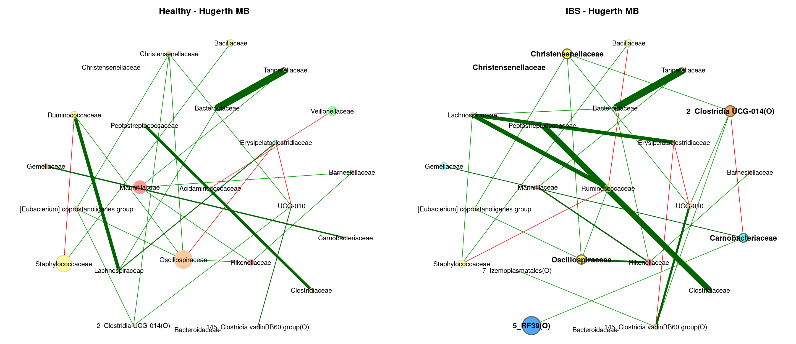
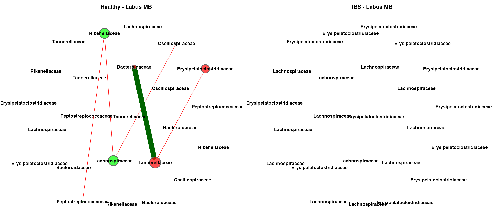

Meta Analysis - Network Comparison (Family)
================
2024-03-01

``` r
myPaths <- .libPaths()
myPaths <- c(myPaths, "~/MetaIBS/MetaIBS-library")
myPaths <- c(myPaths[3], myPaths[1], myPaths[2])
.libPaths(myPaths)  # add new path
```

------------------------------------------------------------------------

# 1. IMPORT

------------------------------------------------------------------------

## 1.1. Libraries

``` r
library(phyloseq) # Handling and analysis of high-throughput microbiome census data.
library(tidyverse)
library(ggplot2)
library(SpiecEasi)
library(igraph)
library(VennDiagram)
library(NetCoMi)
```

------------------------------------------------------------------------

# 2. META-ANALYSIS

------------------------------------------------------------------------

## GLasso

### Meta-Analysis Plot

<!-- -->

### Individual Plots

<!-- --><!-- --><!-- --><!-- --><!-- --><!-- --><!-- --><!-- --><!-- --><!-- --><!-- --><!-- -->

### Global Properties

|  | agp | fukui | hugerth | labus | liu | lopresti | mars | nagel | pozuelo | zeber | zhu | zhuang |
|:---|:---|:---|:---|:---|:---|:---|:---|:---|:---|:---|:---|:---|
| lccSize1 | 77 | 12 | 51 | 4 | 31 | 4 | 27 | 12 | 62 | 11 | 2 | 2 |
| lccSize2 | 84 | 33 | 52 | 3 | 37 | 3 | 32 | 8 | 65 | 30 | 4 | 2 |
| lccSizeRel1 | 0.641666666666667 | 0.27906976744186 | 0.75 | 0.235294117647059 | 0.659574468085106 | 0.285714285714286 | 0.5625 | 0.4 | 0.765432098765432 | 0.25 | 0.111111111111111 | 0.117647058823529 |
| lccSizeRel2 | 0.7 | 0.767441860465116 | 0.764705882352941 | 0.176470588235294 | 0.787234042553192 | 0.214285714285714 | 0.666666666666667 | 0.266666666666667 | 0.802469135802469 | 0.681818181818182 | 0.222222222222222 | 0.117647058823529 |
| avDiss1 | 0.677052759352775 | 0.701828337661062 | 0.678795624945726 | 0.720996121165332 | 0.695774713594914 | 0.710454570833704 | 0.700231461628611 | 0.70995208867751 | 0.698376531899929 | 0.70207294500714 | 0.684973069222763 | 0.718228342425758 |
| avDiss2 | 0.677483201521265 | 0.699815244780589 | 0.687049495449535 | 0.709881333247511 | 0.694541003087561 | 0.711881641472752 | 0.688456219721771 | 0.698852283306592 | 0.696528730993203 | 0.695270347144056 | 0.711643775337206 | 0.707106781186548 |
| avPath1 | 1.77672728629271 | 1.81298725727747 | 1.85191662639231 | 1.20449382234208 | 2.24129501071913 | 0.955658715688707 | 2.17506372992176 | 1.4488148926515 | 1.98430002085159 | 1.50925425503239 | 0.684973069222763 | 0.718228342425758 |
| avPath2 | 1.88639379475507 | 2.13550479446143 | 1.69467720790254 | 0.709881333247511 | 2.17637730526093 | 0.949175521963669 | 2.51111487266508 | 1.67495468975628 | 1.90914279957267 | 1.86579020095858 | 1.06746566300581 | 0.707106781186548 |
| clustCoef1 | 0.657626031088203 | 0.475812277331472 | 0.632465413063933 | 0 | 0.316499649667746 | 0.777615917877924 | 0.516863569237843 | 0.571543655448127 | 0.355234640318413 | 0.513401638410832 | 0 | 0 |
| clustCoef2 | 0.659400992841979 | 0.324476847567113 | 0.503185140660136 | 1 | 0.466858590734153 | 0 | 0.3409720477242 | 0 | 0.543532677603298 | 0.336549625167026 | 0 | 0 |
| modularity1 | 0.289511267516728 | 0.353333333333333 | 0.465102197542533 | 0.166666666666667 | 0.489135355364418 | 0 | 0.560573282855598 | 0.22375 | 0.265510971945153 | 0.303571428571429 | 0 | 0 |
| modularity2 | 0.411246222222222 | 0.329867674858223 | 0.447138894449369 | -0.222222222222222 | 0.414116327511617 | -0.125 | 0.547169811320755 | 0.357142857142857 | 0.258293705901331 | 0.324136703453186 | -0.0555555555555555 | 0 |
| vertConnect1 | 1 | 1 | 1 | 1 | 1 | 1 | 1 | 1 | 1 | 1 | 1 | 1 |
| vertConnect2 | 1 | 1 | 1 | 2 | 1 | 1 | 1 | 1 | 1 | 1 | 1 | 1 |
| edgeConnect1 | 1 | 1 | 1 | 1 | 1 | 1 | 1 | 1 | 1 | 1 | 1 | 1 |
| edgeConnect2 | 1 | 1 | 1 | 2 | 1 | 1 | 1 | 1 | 1 | 1 | 1 | 1 |
| natConnect1 | 0.0385631117459095 | 0.118186439224833 | 0.0367626610674405 | 0.404658225531302 | 0.0419514460555084 | 0.416583801190574 | 0.0489491079777055 | 0.121913912976189 | 0.0271287643267743 | 0.130470463044461 | 0.802555044683375 | 0.795179975672975 |
| natConnect2 | 0.0321285615196434 | 0.0420334697872062 | 0.032140826739077 | 0.573316480010145 | 0.0377367703538924 | 0.554840627923421 | 0.0414748112076192 | 0.182157463552015 | 0.0332587597944434 | 0.0455808178347367 | 0.406227791713017 | 0.797560062837541 |
| density1 | 0.121667805878332 | 0.227272727272727 | 0.144313725490196 | 0.5 | 0.101075268817204 | 0.666666666666667 | 0.122507122507123 | 0.303030303030303 | 0.105235325224749 | 0.254545454545455 | 1 | 1 |
| density2 | 0.107573149741824 | 0.130681818181818 | 0.141025641025641 | 1 | 0.118618618618619 | 0.666666666666667 | 0.106854838709677 | 0.25 | 0.128365384615385 | 0.12183908045977 | 0.5 | 1 |
| pep1 | 82.0224719101124 | 66.6666666666667 | 82.0652173913043 | 0 | 55.3191489361702 | 25 | 65.1162790697674 | 45 | 59.7989949748744 | 57.1428571428571 | 100 | 0 |
| pep2 | 86.6666666666667 | 53.6231884057971 | 64.7058823529412 | 33.3333333333333 | 58.2278481012658 | 50 | 75.4716981132076 | 71.4285714285714 | 57.3033707865169 | 52.8301886792453 | 33.3333333333333 | 0 |

## MB

### Meta-Analysis Plot

<!-- -->

### Individual Plots

<!-- --><!-- --><!-- --><!-- --><!-- --><!-- --><!-- --><!-- --><!-- --><!-- --><!-- --><!-- -->

### Global Properties

|  | agp | fukui | hugerth | labus | liu | lopresti | mars | nagel | pozuelo | zeber | zhu | zhuang |
|:---|:---|:---|:---|:---|:---|:---|:---|:---|:---|:---|:---|:---|
| lccSize1 | 114 | 19 | 59 | 4 | 36 | 4 | 43 | 16 | 76 | 8 | 2 | 3 |
| lccSize2 | 112 | 38 | 64 | 3 | 39 | 3 | 45 | 8 | 76 | 38 | 4 | 2 |
| lccSizeRel1 | 0.95 | 0.441860465116279 | 0.867647058823529 | 0.235294117647059 | 0.765957446808511 | 0.285714285714286 | 0.895833333333333 | 0.533333333333333 | 0.938271604938272 | 0.181818181818182 | 0.111111111111111 | 0.176470588235294 |
| lccSizeRel2 | 0.933333333333333 | 0.883720930232558 | 0.941176470588235 | 0.176470588235294 | 0.829787234042553 | 0.214285714285714 | 0.9375 | 0.266666666666667 | 0.938271604938272 | 0.863636363636364 | 0.222222222222222 | 0.117647058823529 |
| avDiss1 | 0.685949757574428 | 0.70735357096866 | 0.682680843974195 | 0.683801083094393 | 0.694089403259217 | 0.710286019351247 | 0.695672679160091 | 0.711660142667541 | 0.697706694772957 | 0.713060177188327 | 0.669062076024313 | 0.723141589582448 |
| avDiss2 | 0.685568451311238 | 0.69865664915967 | 0.684155860245763 | 0.713373094957244 | 0.691313315818421 | 0.716358814619774 | 0.692288372167632 | 0.690590155996277 | 0.697469648405183 | 0.69386477674308 | 0.714777855240225 | 0.722478949623962 |
| avPath1 | 2.3361126660546 | 2.88148801665437 | 2.30088990661218 | 1.14652220381009 | 2.79072406426384 | 1.18889166345656 | 3.33703468565705 | 2.0551481497494 | 2.15904570962124 | 1.45940578478236 | 0.669062076024313 | 0.96418878610993 |
| avPath2 | 2.31852348881874 | 2.3107358009803 | 2.15103635254469 | 0.951164126609659 | 2.55067804703115 | 0.955145086159698 | 2.8913746415305 | 1.65923776502508 | 1.99701471341387 | 2.18494341779659 | 1.07216678286034 | 0.722478949623962 |
| clustCoef1 | 0.337495277369426 | 0.264842618321507 | 0.383057992559301 | 0 | 0.05822287563282 | 0 | 0.185064673789213 | 0.257368693880079 | 0.154629727681611 | 0.354692667219447 | 0 | 0 |
| clustCoef2 | 0.352489198458416 | 0.215195835370332 | 0.271795047666571 | 0 | 0.184926976406517 | 0 | 0.143248520090929 | 0 | 0.316662484472635 | 0.191380559657251 | 0 | 0 |
| modularity1 | 0.506061980347695 | 0.507231404958678 | 0.542425335015924 | 0.166666666666667 | 0.55137912385073 | 0.166666666666667 | 0.59900826446281 | 0.400277008310249 | 0.395357062019013 | 0.2578125 | 0 | -0.125 |
| modularity2 | 0.508947655972932 | 0.479881656804734 | 0.494960455246914 | -0.125 | 0.542063020214031 | -0.125 | 0.562603550295858 | 0.357142857142857 | 0.380797449558913 | 0.468297937827024 | -0.0555555555555555 | 0 |
| vertConnect1 | 1 | 1 | 1 | 1 | 1 | 1 | 1 | 1 | 1 | 1 | 1 | 1 |
| vertConnect2 | 1 | 1 | 1 | 1 | 1 | 1 | 1 | 1 | 1 | 1 | 1 | 1 |
| edgeConnect1 | 1 | 1 | 1 | 1 | 1 | 1 | 1 | 1 | 1 | 1 | 1 | 1 |
| edgeConnect2 | 1 | 1 | 1 | 1 | 1 | 1 | 1 | 1 | 1 | 1 | 1 | 1 |
| natConnect1 | 0.0129000930673699 | 0.0689867648987764 | 0.0232161600381244 | 0.41131284430812 | 0.0343763394642088 | 0.406629732805812 | 0.0286728034471315 | 0.0835511985425898 | 0.017600610601026 | 0.183250353059721 | 0.806356035716319 | 0.552629983337163 |
| natConnect2 | 0.0134346634907247 | 0.0339354345185475 | 0.0211104044254067 | 0.554356354350517 | 0.0326284852399489 | 0.554096628523195 | 0.0277842631328668 | 0.182977793033225 | 0.0188874233234714 | 0.0334646558564768 | 0.405743792620762 | 0.794293403537163 |
| density1 | 0.0489054494643689 | 0.128654970760234 | 0.0753945061367621 | 0.5 | 0.0682539682539682 | 0.5 | 0.0609080841638981 | 0.158333333333333 | 0.0659649122807018 | 0.285714285714286 | 1 | 0.666666666666667 |
| density2 | 0.051962676962677 | 0.0924608819345661 | 0.0714285714285714 | 0.666666666666667 | 0.0782726045883941 | 0.666666666666667 | 0.0656565656565656 | 0.25 | 0.0750877192982456 | 0.0810810810810811 | 0.5 | 1 |
| pep1 | 86.984126984127 | 45.4545454545455 | 85.2713178294574 | 66.6666666666667 | 51.1627906976744 | 33.3333333333333 | 58.1818181818182 | 42.1052631578947 | 61.7021276595745 | 50 | 100 | 50 |
| pep2 | 90.4024767801858 | 47.6923076923077 | 70.8333333333333 | 0 | 60.3448275862069 | 50 | 63.0769230769231 | 71.4285714285714 | 61.6822429906542 | 61.4035087719298 | 33.3333333333333 | 0 |

## SLR

### Meta-Analysis Plot

<!-- -->

### Individual Plots

<!-- --><!-- --><!-- --><!-- --><!-- --><!-- --><!-- --><!-- --><!-- --><!-- --><!-- --><!-- -->

### Global Properties

|  | agp | fukui | hugerth | labus | liu | lopresti | mars | nagel | pozuelo | zeber | zhu | zhuang |
|:---|:---|:---|:---|:---|:---|:---|:---|:---|:---|:---|:---|:---|
| lccSize1 | 75 | 16 | 32 | 3 | 19 | 3 | 29 | 10 | 54 | 2 | 2 | 3 |
| lccSize2 | 75 | 11 | 41 | 2 | 9 | 2 | 22 | 2 | 54 | 26 | 2 | 2 |
| lccSizeRel1 | 0.625 | 0.372093023255814 | 0.470588235294118 | 0.176470588235294 | 0.404255319148936 | 0.214285714285714 | 0.604166666666667 | 0.333333333333333 | 0.666666666666667 | 0.0454545454545455 | 0.111111111111111 | 0.176470588235294 |
| lccSizeRel2 | 0.625 | 0.255813953488372 | 0.602941176470588 | 0.117647058823529 | 0.191489361702128 | 0.142857142857143 | 0.458333333333333 | 0.0666666666666667 | 0.666666666666667 | 0.590909090909091 | 0.111111111111111 | 0.117647058823529 |
| avDiss1 | 0.696678181454628 | 0.710384867430425 | 0.694202196797631 | 0.668838231690051 | 0.711679117535583 | 0.712457506153323 | 0.700491779649813 | 0.743205098897413 | 0.706817331526178 | 0.687965381468457 | 0.69173864084271 | 0.693836722346124 |
| avDiss2 | 0.693604030304886 | 0.699573427134321 | 0.705315115923528 | 0.713763055240824 | 0.705136176414931 | 0.711314478359194 | 0.700170175794913 | 0.70008722267604 | 0.701681920739468 | 0.706332758766182 | 0.722570805206499 | 0.711860688816766 |
| avPath1 | 2.72892693151867 | 2.51124942489679 | 3.12902840906754 | 0.891784308920067 | 2.67257923986837 | 0.949943341537764 | 2.78425885473539 | 2.24184634043646 | 1.93365134656722 | 0.687965381468457 | 0.69173864084271 | 0.925115629794832 |
| avPath2 | 2.05724577485272 | 1.62079798173019 | 1.46264442727429 | 0.713763055240824 | 1.52597587835749 | 0.711314478359194 | 2.35793140995133 | 0.70008722267604 | 1.96640487001379 | 2.12220373184089 | 0.722570805206499 | 0.711860688816766 |
| clustCoef1 | 0.278740080121863 | 0.148298309117736 | 0.145802658210165 | 0 | 0.156882024738674 | 0 | 0.0874726382558121 | 0 | 0.105546084621592 | 0 | 0 | 0 |
| clustCoef2 | 0.386124322119586 | 0 | 0.369373761442544 | 0 | 0.196652569401561 | 0 | 0 | 0 | 0.100902803926484 | 0.373075602830827 | 0 | 0 |
| modularity1 | 0.547606239913932 | 0.515625 | 0.633873456790124 | -0.125 | 0.535 | -0.125 | 0.528571428571428 | 0.425925925925926 | 0.39310669174953 | 0 | 0 | -0.125 |
| modularity2 | 0.451199187314487 | 0.221938775510204 | 0.292639172871417 | 0 | 0.290123456790123 | 0 | 0.5096 | 0 | 0.398265145823373 | 0.5253125 | 0 | 0 |
| vertConnect1 | 1 | 1 | 1 | 1 | 1 | 1 | 1 | 1 | 1 | 1 | 1 | 1 |
| vertConnect2 | 1 | 1 | 1 | 1 | 1 | 1 | 1 | 1 | 1 | 1 | 1 | 1 |
| edgeConnect1 | 1 | 1 | 1 | 1 | 1 | 1 | 1 | 1 | 1 | 1 | 1 | 1 |
| edgeConnect2 | 1 | 1 | 1 | 1 | 1 | 1 | 1 | 1 | 1 | 1 | 1 | 1 |
| natConnect1 | 0.0168012374826798 | 0.0821513850822112 | 0.0388589654583797 | 0.564450211723356 | 0.0677899638599606 | 0.554546134034189 | 0.0433989253133693 | 0.137728176137206 | 0.0240248185118348 | 0.801859784825239 | 0.800991948885792 | 0.558809903311902 |
| natConnect2 | 0.0202132399431838 | 0.129619761152651 | 0.0387109674595642 | 0.796125092191659 | 0.16016933456862 | 0.796649330899059 | 0.0582804256861524 | 0.799107098218544 | 0.0240918775299876 | 0.0502995945135445 | 0.794274386050127 | 0.796532021211879 |
| density1 | 0.0515315315315315 | 0.133333333333333 | 0.0725806451612903 | 0.666666666666667 | 0.116959064327485 | 0.666666666666667 | 0.0862068965517241 | 0.2 | 0.0852550663871419 | 1 | 1 | 0.666666666666667 |
| density2 | 0.0904504504504505 | 0.254545454545455 | 0.196341463414634 | 1 | 0.25 | 1 | 0.108225108225108 | 1 | 0.0845562543675751 | 0.123076923076923 | 1 | 1 |
| pep1 | 64.3356643356643 | 43.75 | 75 | 50 | 45 | 50 | 54.2857142857143 | 11.1111111111111 | 51.6393442622951 | 100 | 100 | 50 |
| pep2 | 56.9721115537849 | 50 | 56.5217391304348 | 0 | 55.5555555555556 | 0 | 56 | 100 | 57.0247933884297 | 55 | 0 | 0 |
