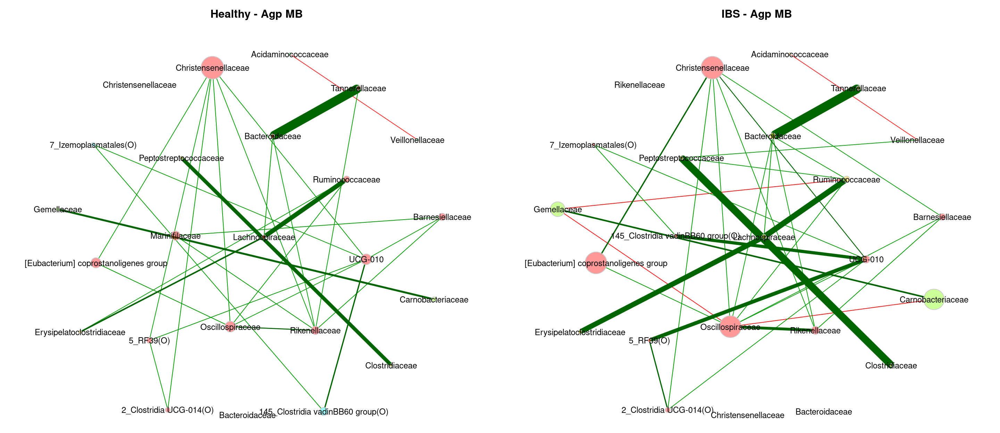
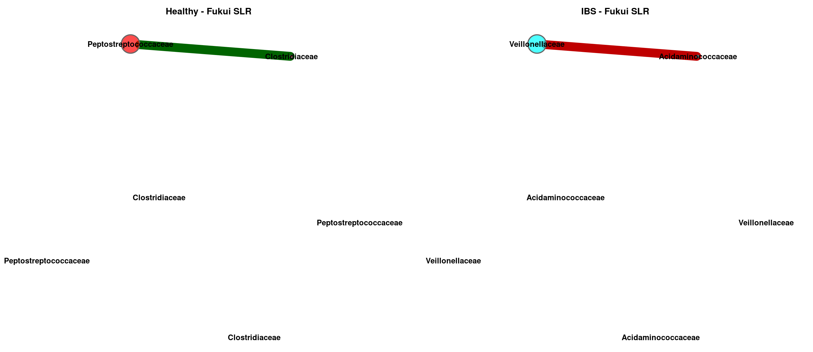
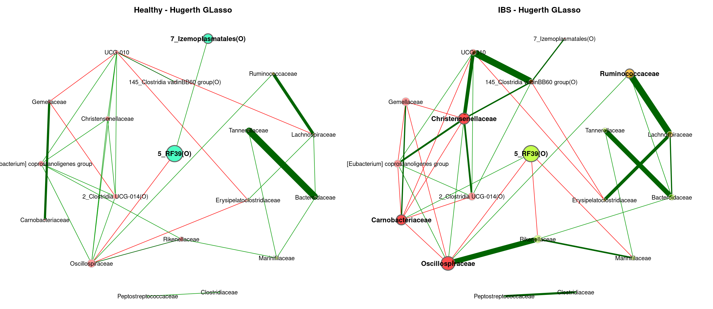
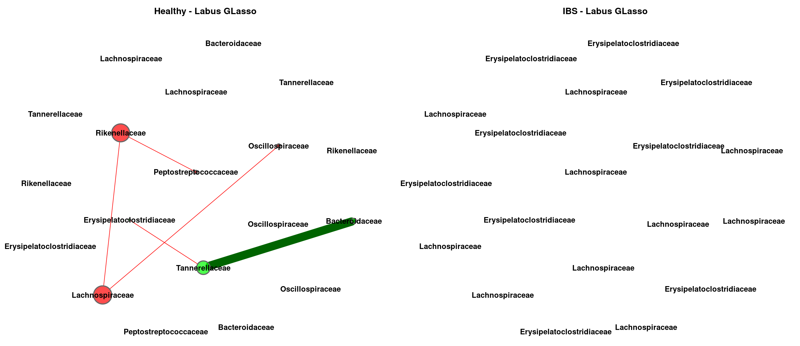
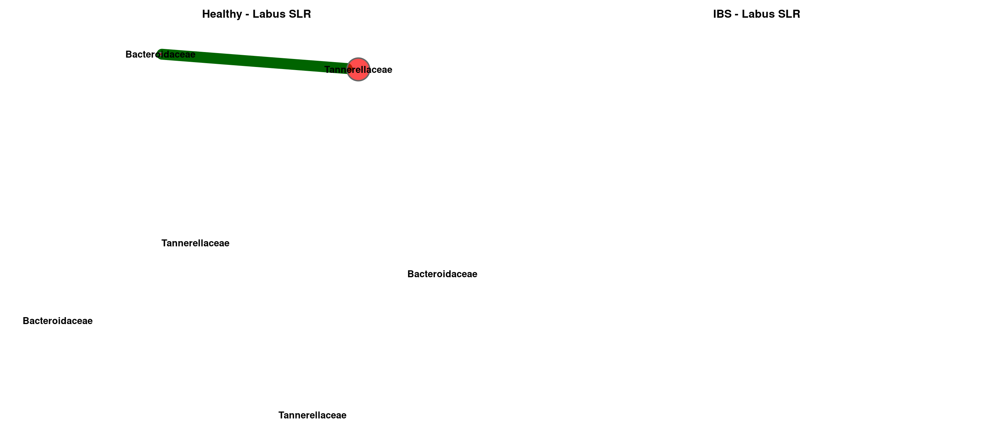
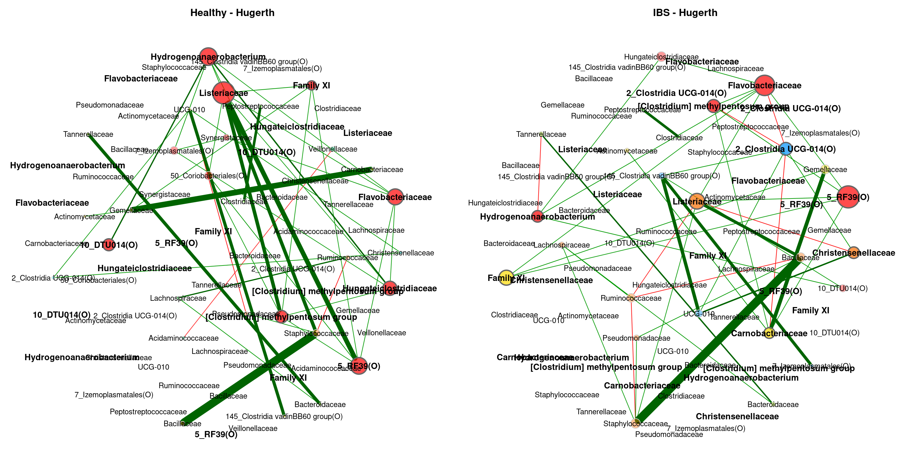

Meta Analysis - Network Comparison (Family)
================
2024-03-01

``` r
myPaths <- .libPaths()
myPaths <- c(myPaths, "~/MetaIBS/MetaIBS-library")
myPaths <- c(myPaths[3], myPaths[1], myPaths[2])
.libPaths(myPaths)  # add new path
```

------------------------------------------------------------------------

# 1. IMPORT

------------------------------------------------------------------------

## 1.1. Libraries

``` r
library(phyloseq) # Handling and analysis of high-throughput microbiome census data.
library(tidyverse)
library(ggplot2)
library(SpiecEasi)
library(igraph)
library(VennDiagram)
library(NetCoMi)
```

------------------------------------------------------------------------

# 2. META-ANALYSIS

------------------------------------------------------------------------

## GLasso

### Meta-Analysis Plot

<!-- -->

### Individual Plots

<!-- --><!-- --><!-- --><!-- --><!-- --><!-- --><!-- --><!-- --><!-- --><!-- --><!-- --><!-- -->

### Global Properties

    ##              agp        fukui      hugerth    labus      liu        lopresti 
    ## lccSize1     77         12         51         4          31         4        
    ## lccSize2     84         33         52         3          37         3        
    ## lccSizeRel1  0.6416667  0.2790698  0.75       0.2352941  0.6595745  0.2857143
    ## lccSizeRel2  0.7        0.7674419  0.7647059  0.1764706  0.787234   0.2142857
    ## avDiss1      0.6770528  0.7018283  0.6787956  0.7209961  0.6957747  0.7104546
    ## avDiss2      0.6774832  0.6998152  0.6870495  0.7098813  0.694541   0.7118816
    ## avPath1      1.776727   1.812987   1.851917   1.204494   2.241295   0.9556587
    ## avPath2      1.886394   2.135505   1.694677   0.7098813  2.176377   0.9491755
    ## clustCoef1   0.657626   0.4758123  0.6324654  0          0.3164996  0.7776159
    ## clustCoef2   0.659401   0.3244768  0.5031851  1          0.4668586  0        
    ## modularity1  0.2895113  0.3533333  0.4651022  0.1666667  0.4891354  0        
    ## modularity2  0.4112462  0.3298677  0.4471389  -0.2222222 0.4141163  -0.125   
    ## vertConnect1 1          1          1          1          1          1        
    ## vertConnect2 1          1          1          2          1          1        
    ## edgeConnect1 1          1          1          1          1          1        
    ## edgeConnect2 1          1          1          2          1          1        
    ## natConnect1  0.03856311 0.1181864  0.03676266 0.4046582  0.04195145 0.4165838
    ## natConnect2  0.03212856 0.04203347 0.03214083 0.5733165  0.03773677 0.5548406
    ## density1     0.1216678  0.2272727  0.1443137  0.5        0.1010753  0.6666667
    ## density2     0.1075731  0.1306818  0.1410256  1          0.1186186  0.6666667
    ## pep1         82.02247   66.66667   82.06522   0          55.31915   25       
    ## pep2         86.66667   53.62319   64.70588   33.33333   58.22785   50       
    ##              mars       nagel     pozuelo    zeber      zhu         zhuang   
    ## lccSize1     27         12        62         11         2           2        
    ## lccSize2     32         8         65         30         4           2        
    ## lccSizeRel1  0.5625     0.4       0.7654321  0.25       0.1111111   0.1176471
    ## lccSizeRel2  0.6666667  0.2666667 0.8024691  0.6818182  0.2222222   0.1176471
    ## avDiss1      0.7002315  0.7099521 0.6983765  0.7020729  0.6849731   0.7182283
    ## avDiss2      0.6884562  0.6988523 0.6965287  0.6952703  0.7116438   0.7071068
    ## avPath1      2.175064   1.448815  1.9843     1.509254   0.6849731   0.7182283
    ## avPath2      2.511115   1.674955  1.909143   1.86579    1.067466    0.7071068
    ## clustCoef1   0.5168636  0.5715437 0.3552346  0.5134016  0           0        
    ## clustCoef2   0.340972   0         0.5435327  0.3365496  0           0        
    ## modularity1  0.5605733  0.22375   0.265511   0.3035714  0           0        
    ## modularity2  0.5471698  0.3571429 0.2582937  0.3241367  -0.05555556 0        
    ## vertConnect1 1          1         1          1          1           1        
    ## vertConnect2 1          1         1          1          1           1        
    ## edgeConnect1 1          1         1          1          1           1        
    ## edgeConnect2 1          1         1          1          1           1        
    ## natConnect1  0.04894911 0.1219139 0.02712876 0.1304705  0.802555    0.79518  
    ## natConnect2  0.04147481 0.1821575 0.03325876 0.04558082 0.4062278   0.7975601
    ## density1     0.1225071  0.3030303 0.1052353  0.2545455  1           1        
    ## density2     0.1068548  0.25      0.1283654  0.1218391  0.5         1        
    ## pep1         65.11628   45        59.79899   57.14286   100         0        
    ## pep2         75.4717    71.42857  57.30337   52.83019   33.33333    0

## MB

### Meta-Analysis Plot

<!-- -->

### Individual Plots

<!-- --><!-- --><!-- --><!-- --><!-- --><!-- --><!-- --><!-- --><!-- --><!-- --><!-- --><!-- -->

### Global Properties

    ##              agp        fukui      hugerth    labus     liu        lopresti 
    ## lccSize1     114        19         59         4         36         4        
    ## lccSize2     112        38         64         3         39         3        
    ## lccSizeRel1  0.95       0.4418605  0.8676471  0.2352941 0.7659574  0.2857143
    ## lccSizeRel2  0.9333333  0.8837209  0.9411765  0.1764706 0.8297872  0.2142857
    ## avDiss1      0.6859498  0.7073536  0.6826808  0.6838011 0.6940894  0.710286 
    ## avDiss2      0.6855685  0.6986566  0.6841559  0.7133731 0.6913133  0.7163588
    ## avPath1      2.336113   2.881488   2.30089    1.146522  2.790724   1.188892 
    ## avPath2      2.318523   2.310736   2.151036   0.9511641 2.550678   0.9551451
    ## clustCoef1   0.3374953  0.2648426  0.383058   0         0.05822288 0        
    ## clustCoef2   0.3524892  0.2151958  0.271795   0         0.184927   0        
    ## modularity1  0.506062   0.5072314  0.5424253  0.1666667 0.5513791  0.1666667
    ## modularity2  0.5089477  0.4798817  0.4949605  -0.125    0.542063   -0.125   
    ## vertConnect1 1          1          1          1         1          1        
    ## vertConnect2 1          1          1          1         1          1        
    ## edgeConnect1 1          1          1          1         1          1        
    ## edgeConnect2 1          1          1          1         1          1        
    ## natConnect1  0.01290009 0.06898676 0.02321616 0.4113128 0.03437634 0.4066297
    ## natConnect2  0.01343466 0.03393543 0.0211104  0.5543564 0.03262849 0.5540966
    ## density1     0.04890545 0.128655   0.07539451 0.5       0.06825397 0.5      
    ## density2     0.05196268 0.09246088 0.07142857 0.6666667 0.0782726  0.6666667
    ## pep1         86.98413   45.45455   85.27132   66.66667  51.16279   33.33333 
    ## pep2         90.40248   47.69231   70.83333   0         60.34483   50       
    ##              mars       nagel     pozuelo    zeber      zhu         zhuang   
    ## lccSize1     43         16        76         8          2           3        
    ## lccSize2     45         8         76         38         4           2        
    ## lccSizeRel1  0.8958333  0.5333333 0.9382716  0.1818182  0.1111111   0.1764706
    ## lccSizeRel2  0.9375     0.2666667 0.9382716  0.8636364  0.2222222   0.1176471
    ## avDiss1      0.6956727  0.7116601 0.6977067  0.7130602  0.6690621   0.7231416
    ## avDiss2      0.6922884  0.6905902 0.6974696  0.6938648  0.7147779   0.7224789
    ## avPath1      3.337035   2.055148  2.159046   1.459406   0.6690621   0.9641888
    ## avPath2      2.891375   1.659238  1.997015   2.184943   1.072167    0.7224789
    ## clustCoef1   0.1850647  0.2573687 0.1546297  0.3546927  0           0        
    ## clustCoef2   0.1432485  0         0.3166625  0.1913806  0           0        
    ## modularity1  0.5990083  0.400277  0.3953571  0.2578125  0           -0.125   
    ## modularity2  0.5626036  0.3571429 0.3807974  0.4682979  -0.05555556 0        
    ## vertConnect1 1          1         1          1          1           1        
    ## vertConnect2 1          1         1          1          1           1        
    ## edgeConnect1 1          1         1          1          1           1        
    ## edgeConnect2 1          1         1          1          1           1        
    ## natConnect1  0.0286728  0.0835512 0.01760061 0.1832504  0.806356    0.55263  
    ## natConnect2  0.02778426 0.1829778 0.01888742 0.03346466 0.4057438   0.7942934
    ## density1     0.06090808 0.1583333 0.06596491 0.2857143  1           0.6666667
    ## density2     0.06565657 0.25      0.07508772 0.08108108 0.5         1        
    ## pep1         58.18182   42.10526  61.70213   50         100         50       
    ## pep2         63.07692   71.42857  61.68224   61.40351   33.33333    0

## SLR

### Meta-Analysis Plot

<!-- -->

### Individual Plots

<!-- --><!-- --><!-- --><!-- --><!-- --><!-- --><!-- --><!-- --><!-- --><!-- --><!-- --><!-- -->

### Global Properties

    ##              agp        fukui      hugerth    labus     liu        lopresti 
    ## lccSize1     75         16         32         3         19         3        
    ## lccSize2     75         11         41         2         9          2        
    ## lccSizeRel1  0.625      0.372093   0.4705882  0.1764706 0.4042553  0.2142857
    ## lccSizeRel2  0.625      0.255814   0.6029412  0.1176471 0.1914894  0.1428571
    ## avDiss1      0.6966782  0.7103849  0.6942022  0.6688382 0.7116791  0.7124575
    ## avDiss2      0.693604   0.6995734  0.7053151  0.7137631 0.7051362  0.7113145
    ## avPath1      2.728927   2.511249   3.129028   0.8917843 2.672579   0.9499433
    ## avPath2      2.057246   1.620798   1.462644   0.7137631 1.525976   0.7113145
    ## clustCoef1   0.2787401  0.1482983  0.1458027  0         0.156882   0        
    ## clustCoef2   0.3861243  0          0.3693738  0         0.1966526  0        
    ## modularity1  0.5476062  0.515625   0.6338735  -0.125    0.535      -0.125   
    ## modularity2  0.4511992  0.2219388  0.2926392  0         0.2901235  0        
    ## vertConnect1 1          1          1          1         1          1        
    ## vertConnect2 1          1          1          1         1          1        
    ## edgeConnect1 1          1          1          1         1          1        
    ## edgeConnect2 1          1          1          1         1          1        
    ## natConnect1  0.01680124 0.08215139 0.03885897 0.5644502 0.06778996 0.5545461
    ## natConnect2  0.02021324 0.1296198  0.03871097 0.7961251 0.1601693  0.7966493
    ## density1     0.05153153 0.1333333  0.07258065 0.6666667 0.1169591  0.6666667
    ## density2     0.09045045 0.2545455  0.1963415  1         0.25       1        
    ## pep1         64.33566   43.75      75         50        45         50       
    ## pep2         56.97211   50         56.52174   0         55.55556   0        
    ##              mars       nagel      pozuelo    zeber      zhu       zhuang   
    ## lccSize1     29         10         54         2          2         3        
    ## lccSize2     22         2          54         26         2         2        
    ## lccSizeRel1  0.6041667  0.3333333  0.6666667  0.04545455 0.1111111 0.1764706
    ## lccSizeRel2  0.4583333  0.06666667 0.6666667  0.5909091  0.1111111 0.1176471
    ## avDiss1      0.7004918  0.7432051  0.7068173  0.6879654  0.6917386 0.6938367
    ## avDiss2      0.7001702  0.7000872  0.7016819  0.7063328  0.7225708 0.7118607
    ## avPath1      2.784259   2.241846   1.933651   0.6879654  0.6917386 0.9251156
    ## avPath2      2.357931   0.7000872  1.966405   2.122204   0.7225708 0.7118607
    ## clustCoef1   0.08747264 0          0.1055461  0          0         0        
    ## clustCoef2   0          0          0.1009028  0.3730756  0         0        
    ## modularity1  0.5285714  0.4259259  0.3931067  0          0         -0.125   
    ## modularity2  0.5096     0          0.3982651  0.5253125  0         0        
    ## vertConnect1 1          1          1          1          1         1        
    ## vertConnect2 1          1          1          1          1         1        
    ## edgeConnect1 1          1          1          1          1         1        
    ## edgeConnect2 1          1          1          1          1         1        
    ## natConnect1  0.04339893 0.1377282  0.02402482 0.8018598  0.8009919 0.5588099
    ## natConnect2  0.05828043 0.7991071  0.02409188 0.05029959 0.7942744 0.796532 
    ## density1     0.0862069  0.2        0.08525507 1          1         0.6666667
    ## density2     0.1082251  1          0.08455625 0.1230769  1         1        
    ## pep1         54.28571   11.11111   51.63934   100        100       50       
    ## pep2         56         100        57.02479   55         0         0
