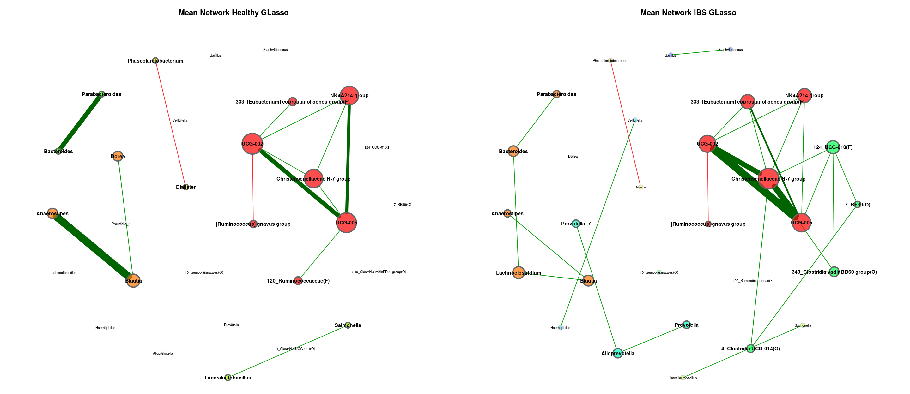
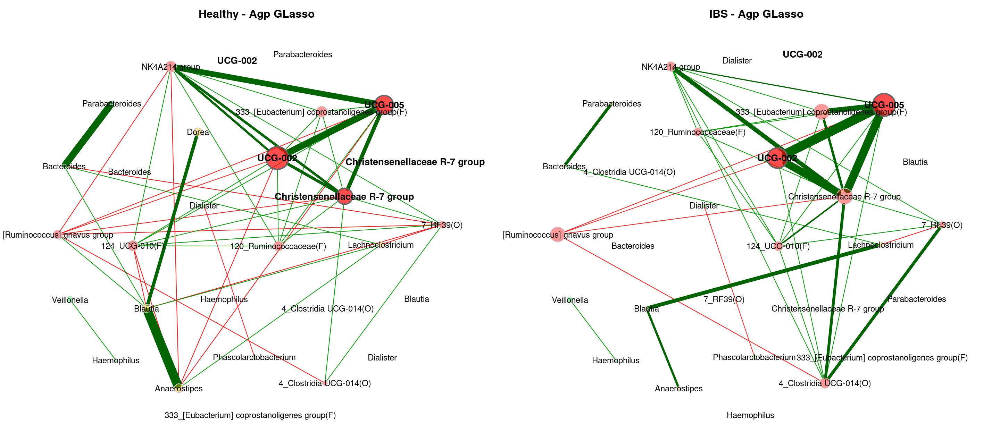
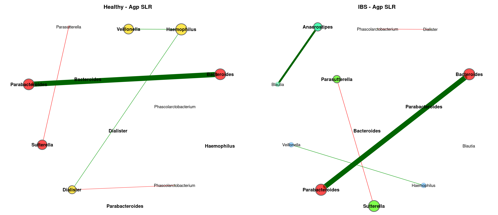
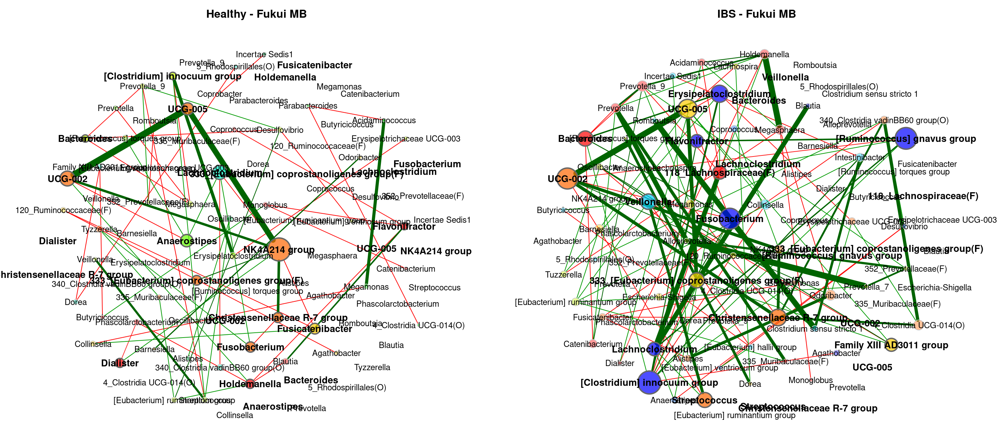
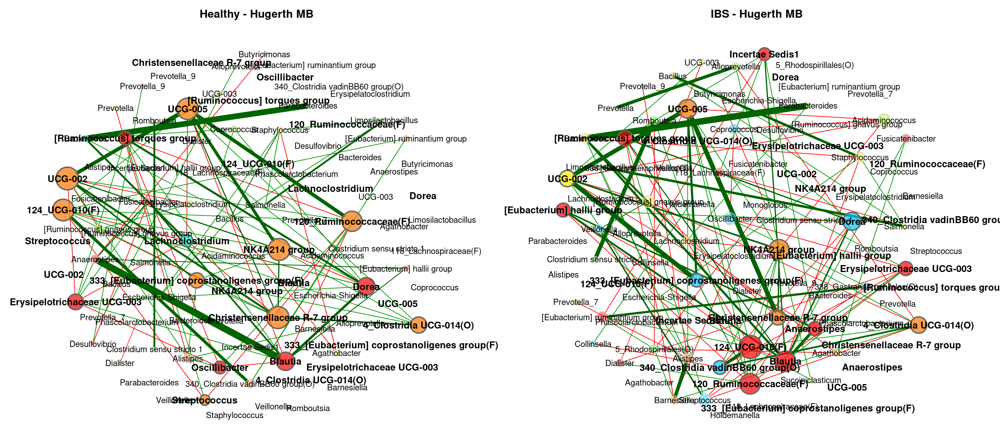
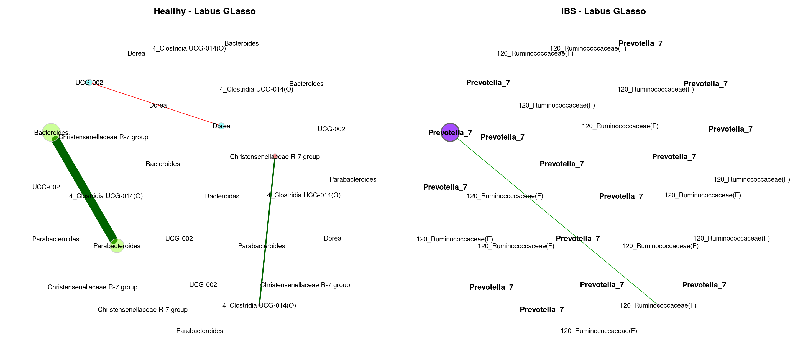
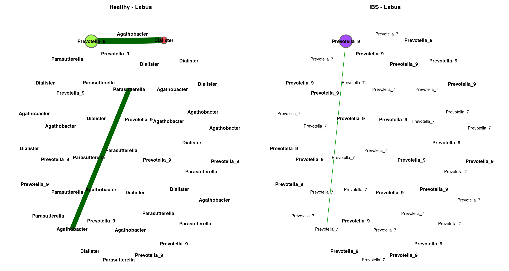

Meta Analysis - Network Comparison (Genus)
================
2024-03-01

``` r
myPaths <- .libPaths()
myPaths <- c(myPaths, "~/MetaIBS/MetaIBS-library")
myPaths <- c(myPaths[3], myPaths[1], myPaths[2])
.libPaths(myPaths)  # add new path
```

------------------------------------------------------------------------

# 1. IMPORT

------------------------------------------------------------------------

## 1.1. Libraries

``` r
library(phyloseq) # Handling and analysis of high-throughput microbiome census data.
library(tidyverse)
library(ggplot2)
library(SpiecEasi)
library(igraph)
library(VennDiagram)
library(NetCoMi)
```

------------------------------------------------------------------------

# 2. META-ANALYSIS

------------------------------------------------------------------------

## GLasso

### Meta-Analysis Plot

<!-- -->

### Individual Plots

<!-- --><!-- --><!-- --><!-- --><!-- --><!-- --><!-- --><!-- --><!-- --><!-- -->

### Global Properties

|  | agp | fukui | hugerth | labus | liu | lopresti | mars | nagel | zeber | zhuang |
|:---|:---|:---|:---|:---|:---|:---|:---|:---|:---|:---|
| lccSize1 | 61 | 57 | 59 | 11 | 64 | 6 | 64 | 41 | 28 | 16 |
| lccSize2 | 58 | 76 | 76 | 12 | 66 | 6 | 74 | 71 | 67 | 45 |
| lccSizeRel1 | 0.717647058823529 | 0.640449438202247 | 0.686046511627907 | 0.159420289855072 | 0.82051282051282 | 0.103448275862069 | 0.771084337349398 | 0.493975903614458 | 0.337349397590361 | 0.186046511627907 |
| lccSizeRel2 | 0.682352941176471 | 0.853932584269663 | 0.883720930232558 | 0.173913043478261 | 0.846153846153846 | 0.103448275862069 | 0.891566265060241 | 0.855421686746988 | 0.807228915662651 | 0.523255813953488 |
| avDiss1 | 0.684092644525173 | 0.706776702473504 | 0.68723984555364 | 0.654685653807912 | 0.692941250524118 | 0.657189727346872 | 0.686750698931715 | 0.70279410366096 | 0.69674508517304 | 0.694984146494764 |
| avDiss2 | 0.68501506159064 | 0.694614740620452 | 0.687753561448468 | 0.66324929672168 | 0.691614346820306 | 0.671561354566903 | 0.690546135717034 | 0.702688234844221 | 0.693538705777574 | 0.697636460825635 |
| avPath1 | 1.86127678656879 | 2.68783664536281 | 1.68452172917981 | 1.13114809929987 | 2.53486849907562 | 0.850043720297976 | 2.5020197349442 | 3.08835446347072 | 2.06007527990578 | 1.9338411025639 |
| avPath2 | 2.11528076569573 | 1.96936195977158 | 1.9539824457542 | 1.99970506515504 | 1.89221570560093 | 1.11417737117408 | 2.60073511260196 | 2.92561099391175 | 2.17571679520189 | 3.02593701801735 |
| clustCoef1 | 0.606463017580748 | 0.209444562313573 | 0.606986715605426 | 0.770561667668695 | 0.29154164332975 | 0.919750963777996 | 0.476284521713277 | 0.442908101519009 | 0.442937324508776 | 0.602464277081437 |
| clustCoef2 | 0.633262460507082 | 0.303415302626081 | 0.315800380994944 | 0.203032650012136 | 0.474538106728569 | 0.583364305246853 | 0.389101663060034 | 0.303033420377804 | 0.337275065004541 | 0.231615763746469 |
| modularity1 | 0.481887064372434 | 0.558069470699433 | 0.35720749948774 | 0.08544921875 | 0.550705467372134 | 0.0330578512396694 | 0.554484911550468 | 0.59640831758034 | 0.367272727272727 | 0.449444444444444 |
| modularity2 | 0.453606316906464 | 0.406977161735133 | 0.396839912614947 | 0.441326530612245 | 0.448689087698189 | 0.122448979591837 | 0.522635762053149 | 0.618172236344473 | 0.367746306727601 | 0.563040657439446 |
| vertConnect1 | 1 | 1 | 1 | 1 | 1 | 1 | 1 | 1 | 1 | 1 |
| vertConnect2 | 1 | 1 | 1 | 1 | 1 | 1 | 1 | 1 | 1 | 1 |
| edgeConnect1 | 1 | 1 | 1 | 1 | 1 | 1 | 1 | 1 | 1 | 1 |
| edgeConnect2 | 1 | 1 | 1 | 1 | 1 | 1 | 1 | 1 | 1 | 1 |
| natConnect1 | 0.0283103050166792 | 0.02175417036994 | 0.0333436116801964 | 0.184727085204811 | 0.0203873062674047 | 0.304301776920674 | 0.0224744373622594 | 0.0313693041585226 | 0.0495885484648655 | 0.0913570888487501 |
| natConnect2 | 0.0288297604001041 | 0.0195367093185731 | 0.0204985086764514 | 0.119636572011578 | 0.0241173486747711 | 0.269655814541384 | 0.0190667610512201 | 0.0176094707242667 | 0.0227437367381368 | 0.0281358284360634 |
| density1 | 0.116939890710383 | 0.0576441102756892 | 0.141437755698422 | 0.581818181818182 | 0.0625 | 0.733333333333333 | 0.0768849206349206 | 0.0841463414634146 | 0.145502645502645 | 0.25 |
| density2 | 0.108287961282517 | 0.0828070175438596 | 0.0852631578947368 | 0.212121212121212 | 0.105827505827506 | 0.466666666666667 | 0.0625694187338023 | 0.0511066398390342 | 0.0877431026684758 | 0.0686868686868687 |
| pep1 | 77.5700934579439 | 54.3478260869565 | 61.5702479338843 | 100 | 62.6984126984127 | 100 | 76.7741935483871 | 52.1739130434783 | 61.8181818181818 | 80 |
| pep2 | 76.536312849162 | 63.135593220339 | 62.1399176954732 | 100 | 62.1145374449339 | 100 | 62.1301775147929 | 54.3307086614173 | 61.8556701030928 | 60.2941176470588 |

## MB

### Meta-Analysis Plot

<!-- -->

### Individual Plots

<!-- --><!-- --><!-- --><!-- --><!-- --><!-- --><!-- --><!-- --><!-- --><!-- -->

### Global Properties

|  | agp | fukui | hugerth | labus | liu | lopresti | mars | nagel | zeber | zhuang |
|:---|:---|:---|:---|:---|:---|:---|:---|:---|:---|:---|
| lccSize1 | 73 | 77 | 66 | 58 | 77 | 16 | 83 | 81 | 81 | 86 |
| lccSize2 | 69 | 84 | 84 | 58 | 76 | 21 | 83 | 83 | 82 | 85 |
| lccSizeRel1 | 0.858823529411765 | 0.865168539325843 | 0.767441860465116 | 0.840579710144927 | 0.987179487179487 | 0.275862068965517 | 1 | 0.975903614457831 | 0.975903614457831 | 1 |
| lccSizeRel2 | 0.811764705882353 | 0.943820224719101 | 0.976744186046512 | 0.840579710144927 | 0.974358974358974 | 0.362068965517241 | 1 | 1 | 0.987951807228916 | 0.988372093023256 |
| avDiss1 | 0.688176039274456 | 0.704400073792871 | 0.687651960319164 | 0.673846115691006 | 0.695039935860265 | 0.657255433017275 | 0.682517222680871 | 0.703019437267016 | 0.68804980762886 | 0.690168187330642 |
| avDiss2 | 0.689226718203443 | 0.695436369008508 | 0.69324427899555 | 0.666447917651617 | 0.688972485106578 | 0.680558469094168 | 0.693647103152941 | 0.69443273154742 | 0.694239448452168 | 0.695317034193448 |
| avPath1 | 2.18486253185973 | 3.18917308403112 | 2.21032218431597 | 4.91766279345684 | 2.59528815739064 | 2.36856770092965 | 2.34333630163468 | 2.81512460575127 | 2.82814289491302 | 1.43863768840387 |
| avPath2 | 2.22007935300891 | 2.25861605191874 | 1.96763479846426 | 4.12656778363748 | 2.20528679764914 | 3.27761266224861 | 2.27655009572415 | 3.29520209640231 | 2.27437546033834 | 2.63543675803981 |
| clustCoef1 | 0.39872073929525 | 0.0992688585056915 | 0.440964136389833 | 0.0807766140090686 | 0.155321794043391 | 0 | 0.134599429341378 | 0.0934986058105641 | 0.0770272395271302 | 0.26539868987346 |
| clustCoef2 | 0.391090786863288 | 0.170802979230985 | 0.157341811148747 | 0.116869525008461 | 0.237284868437845 | 0.0703768617157362 | 0.096891836523946 | 0.137439403512699 | 0.0975678219903495 | 0.079999575321918 |
| modularity1 | 0.531950328707085 | 0.608196159122085 | 0.524200093980947 | 0.676711111111111 | 0.534260204081633 | 0.494140625 | 0.496708877677169 | 0.547841034904726 | 0.56060791015625 | 0.263534333231303 |
| modularity2 | 0.511330632148876 | 0.493108181532214 | 0.430309178397012 | 0.680618924816505 | 0.486090454299621 | 0.579365079365079 | 0.480530753968254 | 0.613325962539022 | 0.427650646057239 | 0.537655961443178 |
| vertConnect1 | 1 | 1 | 1 | 1 | 1 | 1 | 1 | 1 | 1 | 2 |
| vertConnect2 | 1 | 1 | 1 | 1 | 1 | 1 | 1 | 1 | 1 | 1 |
| edgeConnect1 | 1 | 1 | 1 | 1 | 1 | 1 | 1 | 1 | 1 | 2 |
| edgeConnect2 | 1 | 1 | 1 | 1 | 1 | 1 | 1 | 1 | 1 | 1 |
| natConnect1 | 0.0191339821221575 | 0.0154855248299942 | 0.0207591465640591 | 0.0211708963478308 | 0.0162426090429239 | 0.0846929165458116 | 0.0155378591432837 | 0.0149575078524944 | 0.0151167115533541 | 0.0219344844748936 |
| natConnect2 | 0.0201026588275235 | 0.0153868653814658 | 0.0162917600228324 | 0.0211373215002715 | 0.0173397293712744 | 0.0614438856579059 | 0.0152153938317742 | 0.0145564742733467 | 0.0157628017024808 | 0.0144985118587962 |
| density1 | 0.0703957382039574 | 0.0369104579630895 | 0.0713286713286713 | 0.0453720508166969 | 0.0478468899521531 | 0.133333333333333 | 0.0508374963267705 | 0.0404320987654321 | 0.0395061728395062 | 0.135430916552668 |
| density2 | 0.0711849957374254 | 0.0536431440045898 | 0.0676993689041882 | 0.0429522081064731 | 0.0603508771929825 | 0.1 | 0.0493682045254187 | 0.0364384366735234 | 0.0548027702499247 | 0.0417366946778711 |
| pep1 | 83.2432432432432 | 55.5555555555556 | 75.8169934640523 | 77.3333333333333 | 58.5714285714286 | 81.25 | 67.6300578034682 | 42.7480916030534 | 60.9375 | 52.5252525252525 |
| pep2 | 77.2455089820359 | 63.6363636363636 | 61.0169491525424 | 83.0985915492958 | 68.6046511627907 | 76.1904761904762 | 56.547619047619 | 58.0645161290323 | 56.5934065934066 | 52.3489932885906 |

## SLR

### Meta-Analysis Plot

<!-- -->

### Individual Plots

<!-- --><!-- --><!-- --><!-- --><!-- --><!-- --><!-- --><!-- --><!-- --><!-- -->

### Global Properties

|  | agp | fukui | hugerth | labus | liu | lopresti | mars | nagel | zeber | zhuang |
|:---|:---|:---|:---|:---|:---|:---|:---|:---|:---|:---|
| lccSize1 | 15 | 65 | 12 | 7 | 60 | 33 | 72 | 66 | 52 | 53 |
| lccSize2 | 15 | 79 | 72 | 27 | 62 | 6 | 5 | 64 | 68 | 62 |
| lccSizeRel1 | 0.176470588235294 | 0.730337078651685 | 0.13953488372093 | 0.101449275362319 | 0.769230769230769 | 0.568965517241379 | 0.867469879518072 | 0.795180722891566 | 0.626506024096386 | 0.616279069767442 |
| lccSizeRel2 | 0.176470588235294 | 0.887640449438202 | 0.837209302325581 | 0.391304347826087 | 0.794871794871795 | 0.103448275862069 | 0.0602409638554217 | 0.771084337349398 | 0.819277108433735 | 0.720930232558139 |
| avDiss1 | 0.694277493984297 | 0.707222218732302 | 0.698074565161593 | 0.700554953992343 | 0.701516317513328 | 0.709332826300895 | 0.69839271165667 | 0.710321373398142 | 0.702676152837268 | 0.706810130071833 |
| avDiss2 | 0.699694533178149 | 0.708369240974514 | 0.700271400898569 | 0.693686608585729 | 0.698882012160336 | 0.678691299974022 | 0.713157545837753 | 0.702406083640356 | 0.703962006248187 | 0.707770756973495 |
| avPath1 | 2.24399308977448 | 2.48784880702661 | 2.43933913285762 | 1.60124236490534 | 2.0541641339024 | 1.79497076831226 | 2.08993430866355 | 2.15913359781389 | 2.60620064065325 | 1.84456298495406 |
| avPath2 | 2.82054504711751 | 2.97601034554836 | 3.85928926812629 | 2.24703292015971 | 3.47837397045298 | 1.40646811169983 | 1.43374910100067 | 2.50628273550121 | 3.34115906132046 | 2.10502969520337 |
| clustCoef1 | 0.233778178116227 | 0.155101622699796 | 0 | 0.333370133888691 | 0.220529533812367 | 0.331564687895755 | 0.467198676850742 | 0.253061346465065 | 0.278670752782317 | 0.349816034624543 |
| clustCoef2 | 0.212196279613066 | 0.114980335850813 | 0.108016564839166 | 0.0901918012714333 | 0.150555559756704 | 0 | 0 | 0.336477728814175 | 0.128430913530775 | 0.191776053616556 |
| modularity1 | 0.528888888888889 | 0.544055103550296 | 0.46694214876033 | 0.214285714285714 | 0.468724805159903 | 0.338265306122449 | 0.474924846803099 | 0.47013400636981 | 0.544464028200609 | 0.368509993590117 |
| modularity2 | 0.535555555555556 | 0.563622703367256 | 0.704868285123967 | 0.49266975308642 | 0.657064471879287 | 0.26 | 0.21875 | 0.560507015306122 | 0.618832050701675 | 0.475884363852557 |
| vertConnect1 | 1 | 1 | 1 | 1 | 1 | 1 | 1 | 1 | 1 | 1 |
| vertConnect2 | 1 | 1 | 1 | 1 | 1 | 1 | 1 | 1 | 1 | 1 |
| edgeConnect1 | 1 | 1 | 1 | 1 | 1 | 1 | 1 | 1 | 1 | 1 |
| edgeConnect2 | 1 | 1 | 1 | 1 | 1 | 1 | 1 | 1 | 1 | 1 |
| natConnect1 | 0.0890511579266342 | 0.018806535148122 | 0.113751330039583 | 0.216027514894933 | 0.0214601357208924 | 0.0408970180343911 | 0.0193270075962024 | 0.0191141942074387 | 0.0238209076607087 | 0.0255418872610078 |
| natConnect2 | 0.0887241861864443 | 0.0151732435074209 | 0.0164164544078428 | 0.0475295347142159 | 0.0193695377676442 | 0.257768510534053 | 0.314237190491335 | 0.0195381135750601 | 0.0176067543523021 | 0.0201888157205282 |
| density1 | 0.142857142857143 | 0.05 | 0.166666666666667 | 0.333333333333333 | 0.0689265536723164 | 0.132575757575758 | 0.0727699530516432 | 0.0601398601398601 | 0.059577677224736 | 0.0950653120464441 |
| density2 | 0.142857142857143 | 0.0392729633235962 | 0.0344287949921753 | 0.102564102564103 | 0.0428344791115812 | 0.333333333333333 | 0.4 | 0.0555555555555556 | 0.0412642669007902 | 0.0613432046536224 |
| pep1 | 80 | 52.8846153846154 | 72.7272727272727 | 71.4285714285714 | 54.0983606557377 | 45.7142857142857 | 60.2150537634409 | 41.8604651162791 | 58.2278481012658 | 51.1450381679389 |
| pep2 | 93.3333333333333 | 52.8925619834711 | 63.6363636363636 | 63.8888888888889 | 66.6666666666667 | 100 | 50 | 50.8928571428571 | 52.1276595744681 | 49.1379310344828 |
