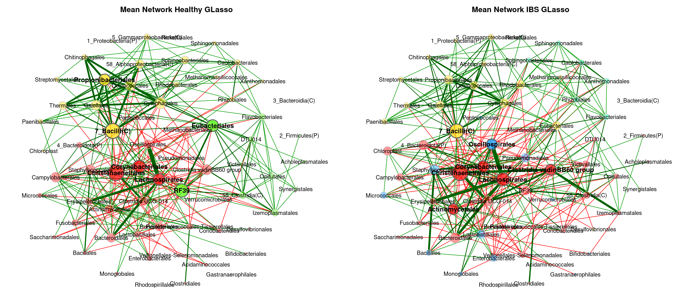
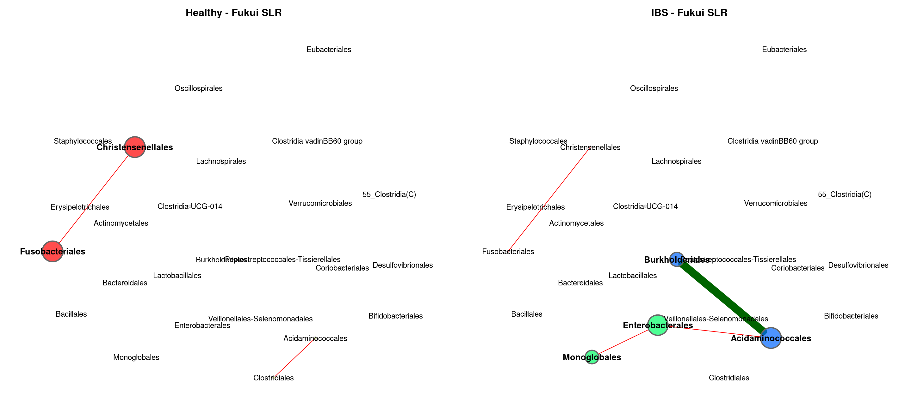
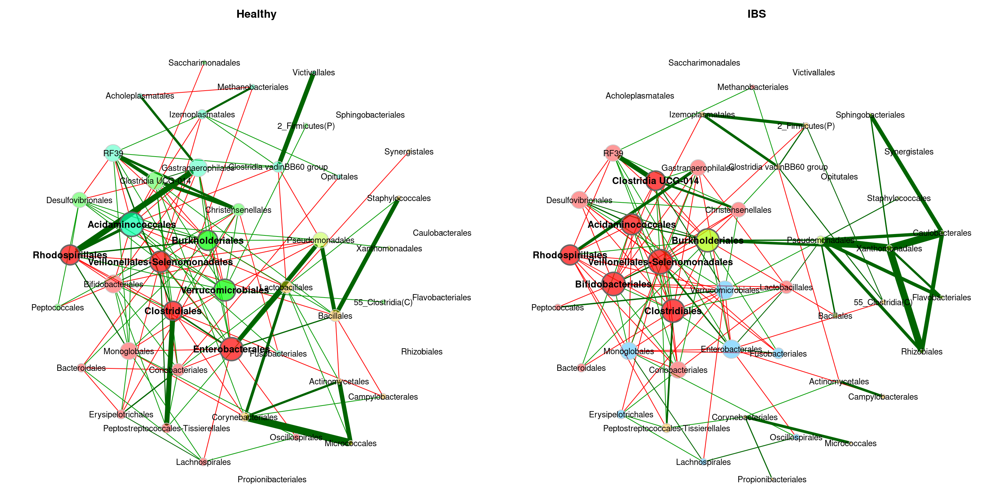
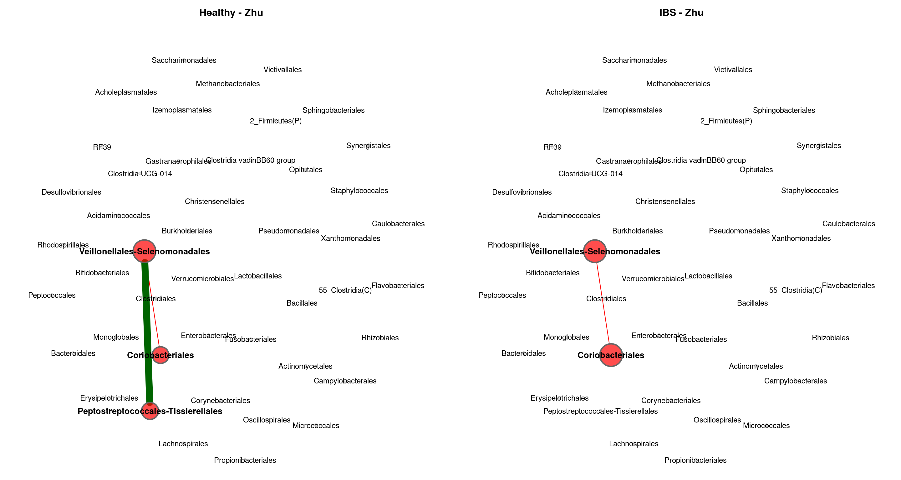

Meta Analysis - Network Comparison (Order)
================
2024-03-01

``` r
myPaths <- .libPaths()
myPaths <- c(myPaths, "~/MetaIBS/MetaIBS-library")
myPaths <- c(myPaths[3], myPaths[1], myPaths[2])
.libPaths(myPaths)  # add new path
```

------------------------------------------------------------------------

# 1. IMPORT

------------------------------------------------------------------------

## 1.1. Libraries

``` r
library(phyloseq) # Handling and analysis of high-throughput microbiome census data.
library(tidyverse)
library(ggplot2)
library(SpiecEasi)
library(igraph)
library(VennDiagram)
library(NetCoMi)
```

------------------------------------------------------------------------

# 2. META-ANAYLSIS

------------------------------------------------------------------------

## GLasso

### Meta-Analysis Plot

<!-- -->

### Individual Plots

<!-- --><!-- --><!-- --><!-- --><!-- --><!-- --><!-- --><!-- --><!-- --><!-- --><!-- -->

### Global Properties

|  | agp | fukui | hugerth | labus | liu | lopresti | mars | nagel | pozuelo | zeber | zhuang |
|:---|:---|:---|:---|:---|:---|:---|:---|:---|:---|:---|:---|
| lccSize1 | 41 | 6 | 28 | 2 | 9 | 2 | 10 | 3 | 26 | 6 | 1 |
| lccSize2 | 43 | 14 | 32 | 1 | 14 | 3 | 16 | 2 | 27 | 15 | 2 |
| lccSizeRel1 | 0.640625 | 0.24 | 0.736842105263158 | 0.2 | 0.321428571428571 | 0.181818181818182 | 0.333333333333333 | 0.15 | 0.604651162790698 | 0.230769230769231 | 0.0833333333333333 |
| lccSizeRel2 | 0.671875 | 0.56 | 0.842105263157895 | 0.1 | 0.5 | 0.272727272727273 | 0.533333333333333 | 0.1 | 0.627906976744186 | 0.576923076923077 | 0.166666666666667 |
| avDiss1 | 0.670816361444919 | 0.717164908953707 | 0.684739894668739 | 0.716657561006751 | 0.70598597745293 | 0.758199440344951 | 0.695726515409433 | 0.701448563967323 | 0.694891997135383 | 0.709360026623731 | 1 |
| avDiss2 | 0.669736497921313 | 0.688924013320701 | 0.693411193207043 | 1 | 0.700752308416031 | 0.718114884058485 | 0.685926101813012 | 0.685867134487338 | 0.699995354084231 | 0.699163641818425 | 0.757060714446395 |
| avPath1 | 1.78276035663805 | 1.39044081615641 | 2.02165275208114 | 0.716657561006751 | 1.22705248292397 | 0.758199440344951 | 1.68635091610992 | 0.935264751956431 | 1.42158794134124 | 1.08501741897223 | 1 |
| avPath2 | 1.69760898597921 | 1.92778603761445 | 1.72956209866596 | 1 | 2.12500855961541 | 0.95748651207798 | 2.30685983395193 | 0.685867134487338 | 1.41200269443649 | 1.55463058602105 | 0.757060714446395 |
| clustCoef1 | 0.622901489626905 | 0.420273909301721 | 0.483491050121892 | 0 | 0.693064333650672 | 0 | 0.291329341742971 | 0 | 0.561986301343408 | 0.695895300239897 | 0 |
| clustCoef2 | 0.675873461199589 | 0.210601708394599 | 0.425886668092749 | 0 | 0.40900388659793 | 0 | 0.447263716485341 | 0 | 0.584802681594056 | 0.473165315115344 | 0 |
| modularity1 | 0.288424012855831 | 0.208333333333333 | 0.482615268329554 | 0 | 0.14030612244898 | 0 | 0.37603305785124 | -0.125 | 0.185150239512266 | 0.1171875 | 0 |
| modularity2 | 0.396922255095332 | 0.419921875 | 0.411160420775805 | 0 | 0.26125 | -0.125 | 0.51875 | 0 | 0.145380434782609 | 0.293950850661626 | 0 |
| vertConnect1 | 1 | 1 | 1 | 1 | 1 | 1 | 1 | 1 | 1 | 1 | 0 |
| vertConnect2 | 1 | 1 | 1 | 0 | 1 | 1 | 1 | 1 | 1 | 1 | 1 |
| edgeConnect1 | 1 | 1 | 1 | 1 | 1 | 1 | 1 | 1 | 1 | 1 | 0 |
| edgeConnect2 | 1 | 1 | 1 | 0 | 1 | 1 | 1 | 1 | 1 | 1 | 1 |
| natConnect1 | 0.0481053914065898 | 0.257450870701749 | 0.053477763785556 | 0.795510838461998 | 0.169939497986004 | 0.787352051700831 | 0.143353494356296 | 0.556835123790119 | 0.0662161298996011 | 0.266735922468136 | 0 |
| natConnect2 | 0.0478305299343294 | 0.0982856609417008 | 0.0454262318538747 | 0 | 0.101127719566956 | 0.553446201711656 | 0.0855367993886562 | 0.802346658294852 | 0.0655247925358143 | 0.0941440137504101 | 0.787559200262837 |
| density1 | 0.160975609756098 | 0.4 | 0.166666666666667 | 1 | 0.388888888888889 | 1 | 0.244444444444444 | 0.666666666666667 | 0.255384615384615 | 0.533333333333333 | 0 |
| density2 | 0.172757475083056 | 0.175824175824176 | 0.157258064516129 | 0 | 0.21978021978022 | 0.666666666666667 | 0.166666666666667 | 1 | 0.262108262108262 | 0.219047619047619 | 1 |
| pep1 | 84.0909090909091 | 33.3333333333333 | 77.7777777777778 | 0 | 50 | 0 | 63.6363636363636 | 50 | 59.0361445783133 | 50 | 0 |
| pep2 | 83.3333333333333 | 62.5 | 52.5641025641026 | 0 | 60 | 0 | 85 | 100 | 55.4347826086957 | 56.5217391304348 | 0 |

## MB

### Meta-Analysis Plot

<!-- -->

### Individual Plots

<!-- --><!-- --><!-- --><!-- --><!-- --><!-- --><!-- --><!-- --><!-- --><!-- --><!-- -->

### Global Properties

|  | agp | fukui | hugerth | labus | liu | lopresti | mars | nagel | pozuelo | zeber | zhuang |
|:---|:---|:---|:---|:---|:---|:---|:---|:---|:---|:---|:---|
| lccSize1 | 52 | 4 | 17 | 2 | 9 | 2 | 12 | 6 | 30 | 7 | 1 |
| lccSize2 | 51 | 17 | 34 | 2 | 14 | 3 | 21 | 2 | 33 | 17 | 2 |
| lccSizeRel1 | 0.8125 | 0.16 | 0.447368421052632 | 0.2 | 0.321428571428571 | 0.181818181818182 | 0.4 | 0.3 | 0.697674418604651 | 0.269230769230769 | 0.0833333333333333 |
| lccSizeRel2 | 0.796875 | 0.68 | 0.894736842105263 | 0.2 | 0.5 | 0.272727272727273 | 0.7 | 0.1 | 0.767441860465116 | 0.653846153846154 | 0.166666666666667 |
| avDiss1 | 0.684835101408427 | 0.716037397669109 | 0.684805878235765 | 0.72235946331456 | 0.704332833623877 | 0.777913214273092 | 0.689206110043741 | 0.70007447198447 | 0.695424735744744 | 0.711103572684033 | 1 |
| avDiss2 | 0.680962767073915 | 0.690670486392418 | 0.685808568807636 | 0.721500328835127 | 0.690853447362993 | 0.722395505159132 | 0.68821267524534 | 0.67163015270575 | 0.69682909540172 | 0.69371944281688 | 0.794210488795536 |
| avPath1 | 2.06277070442834 | 1.19398649896118 | 2.09170824100701 | 0.72235946331456 | 1.3983748320905 | 0.777913214273092 | 1.76397904551401 | 1.31205237066712 | 1.77808086246145 | 1.42852153124376 | 1 |
| avPath2 | 2.23459553517196 | 2.59023511709652 | 2.04621563428957 | 0.721500328835127 | 2.35175473315255 | 0.963194006878842 | 2.71911052685345 | 0.67163015270575 | 1.87848750480668 | 1.83930342449842 | 0.794210488795536 |
| clustCoef1 | 0.43898396915104 | 0 | 0.207123468014977 | 0 | 0.485166648768061 | 0 | 0.211218159084168 | 0 | 0.139909981841888 | 0 | 0 |
| clustCoef2 | 0.434379163720729 | 0.101440160796164 | 0.339086424645566 | 0 | 0.256891639555127 | 0 | 0.31034515103289 | 0 | 0.260366966149527 | 0.273654101601486 | 0 |
| modularity1 | 0.457789748337682 | 0.166666666666667 | 0.430785123966942 | 0 | 0.31404958677686 | 0 | 0.428994082840237 | 0.22 | 0.31265943877551 | 0.319444444444445 | 0 |
| modularity2 | 0.527399274580924 | 0.551903114186851 | 0.479316288422867 | 0 | 0.41015625 | -0.125 | 0.578993055555556 | 0 | 0.3331298828125 | 0.444598337950139 | 0 |
| vertConnect1 | 1 | 1 | 1 | 1 | 1 | 1 | 1 | 1 | 1 | 1 | 0 |
| vertConnect2 | 1 | 1 | 1 | 1 | 1 | 1 | 1 | 1 | 1 | 1 | 1 |
| edgeConnect1 | 1 | 1 | 1 | 1 | 1 | 1 | 1 | 1 | 1 | 1 | 0 |
| edgeConnect2 | 1 | 1 | 1 | 1 | 1 | 1 | 1 | 1 | 1 | 1 | 1 |
| natConnect1 | 0.0264381693210412 | 0.406111379487979 | 0.0801193204578762 | 0.794318150555823 | 0.163343439801811 | 0.78391472702233 | 0.116303872658819 | 0.25539000373601 | 0.0449203191390361 | 0.21200839330053 | 0 |
| natConnect2 | 0.0267048018781131 | 0.0776104186396624 | 0.0390900085609928 | 0.794496385462432 | 0.0978706502427744 | 0.552656653462292 | 0.0620836171191504 | 0.80573072687802 | 0.0409410096914233 | 0.0783205085431813 | 0.781286811537819 |
| density1 | 0.0822021116138763 | 0.5 | 0.161764705882353 | 1 | 0.305555555555556 | 1 | 0.196969696969697 | 0.333333333333333 | 0.128735632183908 | 0.285714285714286 | 0 |
| density2 | 0.0792156862745098 | 0.125 | 0.105169340463458 | 1 | 0.175824175824176 | 0.666666666666667 | 0.114285714285714 | 1 | 0.121212121212121 | 0.139705882352941 | 1 |
| pep1 | 84.4036697247707 | 33.3333333333333 | 63.6363636363636 | 0 | 54.5454545454545 | 0 | 61.5384615384615 | 40 | 66.0714285714286 | 50 | 0 |
| pep2 | 90.0990099009901 | 58.8235294117647 | 64.4067796610169 | 0 | 62.5 | 0 | 70.8333333333333 | 100 | 56.25 | 57.8947368421053 | 0 |

## SLR

### Meta-Analysis Plot

<!-- -->

### Individual Plots

<!-- --><!-- --><!-- --><!-- --><!-- --><!-- --><!-- --><!-- --><!-- --><!-- --><!-- --><!-- -->

### Global Properties

|  | agp | fukui | hugerth | labus | liu | lopresti | mars | nagel | pozuelo | zeber | zhuang |
|:---|:---|:---|:---|:---|:---|:---|:---|:---|:---|:---|:---|
| lccSize1 | 32 | 2 | 21 | 4 | 2 | 3 | 5 | 3 | 23 | 3 | 2 |
| lccSize2 | 36 | 12 | 22 | 2 | 18 | 3 | 2 | 2 | 19 | 4 | 2 |
| lccSizeRel1 | 0.5 | 0.08 | 0.552631578947368 | 0.4 | 0.0714285714285714 | 0.272727272727273 | 0.166666666666667 | 0.15 | 0.534883720930233 | 0.115384615384615 | 0.166666666666667 |
| lccSizeRel2 | 0.5625 | 0.48 | 0.578947368421053 | 0.2 | 0.642857142857143 | 0.272727272727273 | 0.0666666666666667 | 0.1 | 0.441860465116279 | 0.153846153846154 | 0.166666666666667 |
| avDiss1 | 0.702436444789649 | 0.77675100547912 | 0.698677907659768 | 0.715154353025692 | 0.814075536351993 | 0.728680717264958 | 0.697205749343734 | 0.696506152800208 | 0.700333899078503 | 0.705598739423874 | 0.698965252365136 |
| avDiss2 | 0.69776064897028 | 0.705190518729424 | 0.699033807800474 | 0.70118206698504 | 0.70892985419425 | 0.729022902260926 | 0.734006217080058 | 0.695051740790871 | 0.707382724806307 | 0.681223668753848 | 0.768654314993616 |
| avPath1 | 1.62684134548249 | 0.77675100547912 | 3.0573620746817 | 1.19264280215732 | 0.814075536351993 | 0.971574289686611 | 1.19138699525083 | 0.928674870400278 | 2.22893331081111 | 0.940798319231832 | 0.698965252365136 |
| avPath2 | 2.15351751021555 | 1.73798502557191 | 2.9214470690543 | 0.70118206698504 | 2.02944067044043 | 0.972030536347902 | 0.734006217080058 | 0.695051740790871 | 1.68319340253557 | 1.13966868943498 | 0.768654314993616 |
| clustCoef1 | 0.357237112898505 | 0 | 0 | 0 | 0 | 0 | 0.585837774465959 | 0 | 0.0789623892090965 | 0 | 0 |
| clustCoef2 | 0.44139052758613 | 0.166361700539046 | 0 | 0 | 0.424310422874719 | 0 | 0 | 0 | 0.379002542422084 | 0 | 0 |
| modularity1 | 0.281751933372992 | 0 | 0.59375 | 0.166666666666667 | 0 | -0.125 | 0.22 | -0.125 | 0.447222222222222 | -0.125 | 0 |
| modularity2 | 0.531739734179726 | 0.357777777777778 | 0.529513888888889 | 0 | 0.435650887573965 | -0.125 | 0 | 0 | 0.334342560553633 | 0.166666666666667 | 0 |
| vertConnect1 | 1 | 1 | 1 | 1 | 1 | 1 | 1 | 1 | 1 | 1 | 1 |
| vertConnect2 | 1 | 1 | 1 | 1 | 1 | 1 | 1 | 1 | 1 | 1 | 1 |
| edgeConnect1 | 1 | 1 | 1 | 1 | 1 | 1 | 1 | 1 | 1 | 1 | 1 |
| edgeConnect2 | 1 | 1 | 1 | 1 | 1 | 1 | 1 | 1 | 1 | 1 | 1 |
| natConnect1 | 0.0449182689277954 | 0.784109540652306 | 0.0604905295207587 | 0.405548603408225 | 0.778347238505818 | 0.55154185110477 | 0.323108643186732 | 0.557761271009466 | 0.056283574572001 | 0.555892622295975 | 0.799357570526995 |
| natConnect2 | 0.0371754719502838 | 0.116727752483208 | 0.058078647341931 | 0.798863531434844 | 0.0748359264490348 | 0.55137025028851 | 0.791953672526883 | 0.80023812748715 | 0.0725814271793718 | 0.411952327781948 | 0.785494007902833 |
| density1 | 0.165322580645161 | 1 | 0.0952380952380952 | 0.5 | 1 | 0.666666666666667 | 0.5 | 0.666666666666667 | 0.118577075098814 | 0.666666666666667 | 1 |
| density2 | 0.112698412698413 | 0.227272727272727 | 0.103896103896104 | 1 | 0.169934640522876 | 0.666666666666667 | 1 | 1 | 0.198830409356725 | 0.5 | 1 |
| pep1 | 67.0731707317073 | 0 | 70 | 0 | 0 | 0 | 80 | 100 | 63.3333333333333 | 100 | 100 |
| pep2 | 64.7887323943662 | 60 | 62.5 | 100 | 42.3076923076923 | 0 | 0 | 100 | 58.8235294117647 | 66.6666666666667 | 0 |
